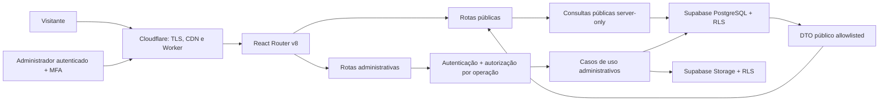

# Visão do monólito modular e limites de confiança

**Estado:** baseline da Etapa 1  
**Escopo:** estrutura lógica; não representa implementação concluída

## Decisão estrutural

O produto será um **monólito modular**: um projeto React Router v8 em modo framework, um artefato de Worker e um fluxo de deploy, com módulos internos de responsabilidade explícita. O site público e o painel administrativo compartilham o deploy e a linguagem visual, mas não compartilham permissões, DTOs sensíveis nem política de cache.

Não há justificativa atual para microserviços, CMS genérico, aplicação administrativa separada ou autenticação própria.

## Módulos lógicos

| Módulo | Responsabilidade | Não pode fazer |
|---|---|---|
| `public` | Páginas, filtros e leitura do catálogo publicado | Consultar tabela privada; receber endereço exato, notas, leads, auditoria ou dados de auth |
| `admin` | Interface autenticada e orquestração de fluxos administrativos | Ser a barreira de autorização; confiar em botão oculto, URL ou papel enviado pelo cliente |
| `domain` | Entidades, estados, invariantes e contratos sem dependência de UI/fornecedor | Importar runtime do navegador, Worker, Supabase ou componentes |
| `application` | Casos de uso, queries, commands e DTOs | Expor objeto de persistência diretamente à UI |
| `server-only` | Sessão, autorização, repositórios, gateways e segredos | Ser importado por componente ou bundle do navegador |
| `validation` | Schemas de entrada e normalização em limites de confiança | Tratar tipagem TypeScript como validação de runtime |
| `ui` | Tokens e componentes derivados do contrato visual | Buscar dados, acessar segredo ou impor regra de autorização |
| `worker` | Composition root, contexto de requisição, headers e integração da plataforma | Concentrar regra de negócio ou criar dependências circulares |

Os nomes físicos podem se ajustar às convenções do scaffold oficial. As fronteiras acima são obrigatórias mesmo que a árvore de pastas mude.

## Regras de dependência

1. Componentes do navegador dependem apenas de contratos serializáveis, validações explicitamente isomórficas e UI.
2. Nenhum módulo cliente importa arquivo `*.server.ts`, lê `env` privado ou instancia cliente privilegiado.
3. Loaders fazem leitura; actions fazem mutação. Ambos são endpoints públicos do ponto de vista de ameaça.
4. Toda operação administrativa revalida sessão, AAL/MFA, papel, ação e alvo no servidor.
5. A camada de aplicação chama portas; integrações Supabase e Cloudflare são adaptadores server-only.
6. O domínio não conhece cookies, headers, React Router, Supabase ou Cloudflare.
7. DTOs são construídos dentro do limite confiável e validados antes de cruzar para UI ou resposta HTTP.

## Limites de confiança

### Navegador público

Tudo é não confiável: query string, filtros, slug, ID, headers, origem, campos ocultos e conteúdo de formulário. A resposta pode conter somente o DTO público documentado. A chave publicável do Supabase, se for enviada ao navegador, não é segredo e depende integralmente de GRANT/RLS corretos.

### Navegador administrativo

Uma sessão válida não torna o payload confiável. IDs, papéis, status, caminhos de mídia e qualquer claim apresentado pelo cliente devem ser novamente validados e autorizados no servidor. A UI administrativa é conveniência; não é controle de acesso.

### Worker/server-only

É o ponto de composição confiável para ler segredos e aplicar autorização. Ainda assim, usa privilégio mínimo e evita a chave secreta do Supabase quando uma sessão de usuário com RLS resolve a operação. Erros externos são traduzidos sem SQL, stack, policy ou PII.

### Banco e Storage

GRANT mínimo e RLS default-deny são a barreira final. RLS não substitui autorização por caso de uso, mas limita o impacto quando uma action, query ou ID estiver errado. Chaves secretas/`service_role` ignoram RLS e ficam restritas a rotinas server-only nominadas e revisadas.

## Contrato do DTO público

O DTO é uma allowlist, nunca uma exclusão tardia de campos. A forma exata será versionada na Etapa 2; estas classes de dados são permitidas ou proibidas desde já:

| Permitido somente quando publicado e aprovado | Sempre proibido no DTO público |
|---|---|
| código público, slug, finalidade e tipo | ID interno quando não necessário |
| cidade e bairro | endereço e coordenadas exatos |
| preço/regra “sob consulta” | contato e dados do proprietário |
| características publicáveis | notas internas e documentos/autorização |
| descrição em texto seguro | rascunhos, histórico editorial e auditoria |
| mídias derivadas aprovadas e alt text | originais privados e caminhos internos |
| status de negócio publicável | usuários, papéis, sessão, leads e segredos |

Serialização, HTML SSR, hydration data, metadata, JSON-LD, sitemap, logs, erros e cache devem obedecer à mesma fronteira.

## Fronteira de cache

- Admin, login, recuperação, loaders/actions autenticados e respostas com informação por usuário: `Cache-Control: private, no-store` e `X-Robots-Tag: noindex, nofollow`.
- Catálogo e detalhe: leitura dinâmica da projeção pública, sem cache compartilhado manual nesta fase.
- Assets estáticos com hash: podem usar cache público longo porque não contêm sessão ou dado mutável.
- Nenhuma Cache Rule pode substituir `no-store` em rotas autenticadas.

Veja o [ADR-0005](adr/0005-dynamic-catalog-admin-no-store.md).

## Gates arquiteturais

- teste de build falha ao importar `*.server.ts` em cliente;
- teste prova que o DTO não contém chaves privadas;
- chamadas diretas a loaders/actions são testadas como anônimo, `aal1`, sem papel, editor e owner conforme aplicável;
- RLS é testada no banco, não simulada apenas em mocks;
- bundle e artefatos não contêm chave secreta, PII, endereço exato ou fixture de produção;
- nenhum dado de preview vem de produção;
- cada integração paga ou binding novo exige decisão e revalidação de limites.
