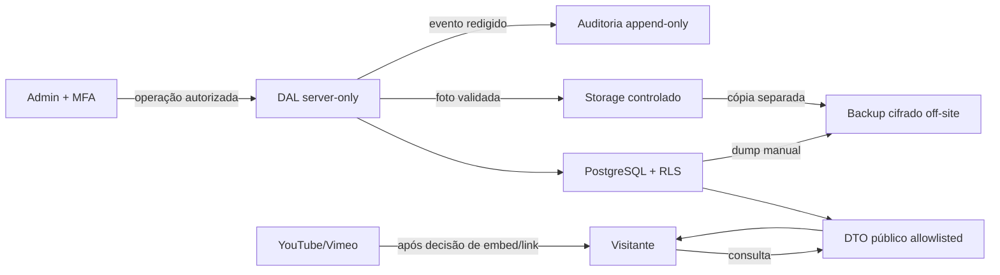

# Inventário de dados e LGPD — Etapa 2

**Estado:** inicial; bases legais, retenções e responsáveis exigem validação humana  
**Natureza:** apoio de engenharia, não parecer jurídico

## Princípios

- coletar somente o necessário;
- separar público/privado na origem e no DTO;
- usar somente dados sintéticos em dev, CI e preview;
- não logar token, cookie, segredo, autorização, endereço exato ou payload integral;
- não persistir leads antes de finalidade, base legal e retenção;
- inventariar banco, mídia e backups separadamente;
- não tratar região do fornecedor como prova isolada de conformidade.

## Inventário

| Conjunto | Titulares | Conteúdo esperado | Finalidade | Acesso | Local | Público? | Base legal | Retenção | Estado |
|---|---|---|---|---|---|---|---|---|---|
| Imóvel público | proprietário/ocupante pode ser relacionado | código, slug, tipo, cidade, bairro, características, preço/regra, descrição | anúncio autorizado e busca | todos via DTO; admins | PostgreSQL `sa-east-1` se disponível | após gates | a validar | ciclo/histórico pendente | Planejado |
| Detalhe privado | proprietário, ocupante, contato | endereço/coordenada, contato, notas | operação do anúncio | editor/owner `aal2` | PostgreSQL | nunca | a validar | pendente | Planejado; alto cuidado |
| Autorização/comprovação | proprietário e profissional | confirmação, data, referência e eventual documento | gate legal/editorial | acesso administrativo mínimo | banco/Storage privado | nunca | a validar | pendente | Formato aberto |
| Foto original | pessoas identificáveis | JPEG/WebP reencodado e metadado técnico mínimo | preparar anúncio | admins `aal2` | Storage | privado | a validar | original pendente | Planejado |
| Foto derivada | pessoas identificáveis | otimizada/aprovada e alt text | exibição | todos quando publicada | Storage | controlado | a validar | ligada à publicação; expurgo pendente | Planejado |
| Referência de vídeo | pessoas no vídeo/dono da conta | provedor, ID e confirmação de tratamento | apresentar vídeo tratado | admins; público conforme decisão de embed/link | banco + provedor externo | URL/ID pode ser público | a validar | pendente | Planejado |
| Identidade Auth | administradores | UUID, e-mail, conta e fatores geridos pelo fornecedor | autenticação/MFA | usuário, Auth e operação controlada | Supabase Auth | privado | a validar | pendente | Fornecedor |
| Membro admin | administradores | `user_id`, papel, status, timestamps | autorização | próprio vínculo; owner governa | PostgreSQL | privado | a validar | após desativação: pendente | Planejado |
| Auditoria | admins/entidade afetada | ator, ação, alvo, horário, request ID, resumo redigido | investigação/recuperação | owner e operação técnica | PostgreSQL | privado | a validar | período pendente | Planejado append-only |
| Logs | visitantes/admins indiretamente | request ID, rota, resultado e IP somente se necessário/minimizado | operação e segurança | responsável nominal | Cloudflare/Supabase/app | privado | a validar | prazo/IP pendentes | Esquema pendente |
| Backup do banco | titulares copiados | roles/schema/data necessários | continuidade | responsável nominal | staging cifrado + off-site aprovado | privado | acompanha os dados; validar | RPO/RTO/retenção pendentes | Obrigatório pré-go-live |
| Backup de mídia | pessoas nas fotos | objetos, manifesto, checksums | continuidade | responsável nominal | staging cifrado + off-site aprovado | privado | a validar | RPO/RTO/retenção pendentes | Obrigatório pré-go-live |
| Leads | visitante interessado | **nenhum campo nesta etapa** | não aprovada | ninguém | não há tabela/bucket/DTO | N/A | pendente | pendente | **Não coletar/persistir** |

## Fluxos

Não existe fluxo de formulário para `leads`: nenhuma payload de interesse deve aparecer em banco, Storage, auditoria ou log.

## Dados proibidos por superfície

| Superfície | Nunca conter |
|---|---|
| DTO/HTML/JSON-LD/sitemap | endereço/coordenada, contato do proprietário, notas, autorização, usuário, auditoria, original, lead |
| Logs | senha, token/JWT, cookie, chave, payload integral, documento, endereço exato, URL assinada |
| Nome/path de arquivo | pessoa, telefone, endereço, coordenada ou identificação documental |
| Dev/CI/preview | dado real de cliente, admin, proprietário, imóvel ou visitante |
| Analytics/pixels | nenhum dado; recursos não aprovados |

## Decisões obrigatórias antes de dados reais

- controlador, operadores/suboperadores e canal do titular;
- base legal e retenção por finalidade, inclusive backup;
- forma de armazenar comprovação/autorização;
- tratamento de IP e eventos de autenticação;
- vídeo externo, cookies e transferências;
- destino off-site, criptografia, RPO/RTO e responsável;
- resposta a direitos do titular e incidente.

## Evidência necessária

- migrations que comprovem a separação;
- testes da projeção/RLS e inspeção de logs/objetos;
- restore isolado de banco e mídia;
- registro das decisões humanas;
- confirmação automatizada de que `leads` não existe.

Veja o [ADR-0009](adr/0009-no-persisted-leads-until-legal-decision.md), a [matriz de acesso](access-control-matrix-stage-2.md) e o [runbook](backup-restore-runbook.md).
