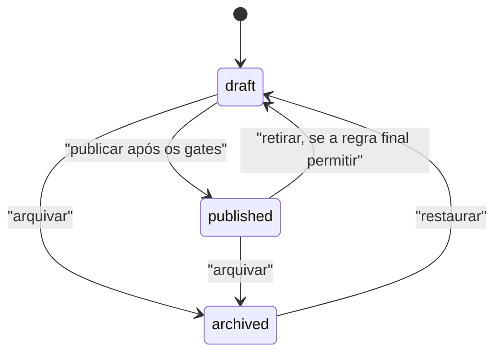
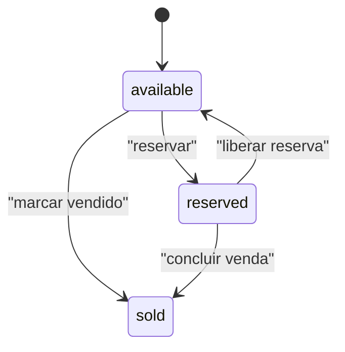

# Modelo de domínio — Etapa 2

**Estado:** implementado em migrations e contratos; reconstrução PostgreSQL local e 52 testes pgTAP aprovados em 5 de setembro de 2026
**Data:** 3 de setembro de 2026

Este documento fixa a linguagem e as invariantes conhecidas. Não substitui migrations, constraints, RLS ou schemas de runtime; nomes físicos devem ser conferidos contra a implementação final.

## Contexto e linguagem canônica

O contexto operacional é **gestão e publicação de imóveis**. Administradores preparam um imóvel, mantêm dados privados, vinculam mídia e publicam uma projeção segura. Autenticação vem do Supabase Auth; Storage guarda fotos; vídeo é somente referência externa validada. Leads não integram o modelo persistido enquanto finalidade, base legal e retenção estiverem pendentes.

| Termo | Significado | Não significa |
|---|---|---|
| Imóvel | agregado editorial e comercial preparado para anúncio | endereço privado, documento ou arquivo isolado |
| Estado de publicação | `draft`, `published` ou `archived` | situação da negociação |
| Estado do negócio | `available`, `reserved` ou `sold` | autorização para aparecer no site |
| Detalhes privados | endereço/coordenada exatos, contato, notas e comprovações | extensão do DTO público |
| Mídia | foto controlada ou referência normalizada de vídeo | arquivo arbitrário ou HTML de embed |
| Derivado público | foto aprovada, sem metadados sensíveis | original enviado ao bucket privado |
| Membro administrativo | identidade Auth com vínculo ativo e papel | qualquer usuário autenticado |
| Owner | papel responsável também pela governança de membros | proprietário civil do imóvel |
| Editor | papel que opera imóveis dentro das permissões | gestor de papéis ou do último owner |
| Projeção pública | query/relação allowlisted de anúncios publicados | tabela base filtrada no navegador |
| Evento de auditoria | registro append-only redigido de ação relevante | log técnico integral ou depósito de PII |
| Exclusão lógica | retirada recuperável que preserva histórico | apagamento físico definitivo |
| Lead | contato de visitante | entidade autorizada nesta etapa; não será persistido |

## Relações conceituais

```mermaid
erDiagram
    AUTH_USER ||--o| ADMIN_MEMBER : "pode ser habilitado como"
    AUTH_USER ||--o{ PROPERTY : "cria ou atualiza"
    AUTH_USER ||--o{ AUDIT_EVENT : "pode atuar em"
    PROPERTY ||--o| PROPERTY_PRIVATE_DETAIL : "protege"
    PROPERTY ||--o{ PROPERTY_MEDIA : "organiza"
    PROPERTY ||--o{ AUDIT_EVENT : "é alvo de"

    AUTH_USER {
      bigint id PK
      string email "restrito ao Auth"
      string aal "claim validada"
    }
    ADMIN_MEMBER {
      uuid user_id PK
      string role "owner ou editor"
      string status "ativo ou desativado"
    }
    PROPERTY {
      uuid id PK
      string public_code UK
      string slug UK
      string publication_status
      string deal_status
      integer version "concorrência"
      timestamptz published_at
      timestamptz archived_at
      timestamptz deleted_at
      uuid created_by
      uuid updated_by
    }
    PROPERTY_PRIVATE_DETAIL {
      uuid property_id PK_FK
      string exact_address "privado"
      decimal exact_coordinates "privado"
      string owner_contact "privado"
      string internal_notes "privado"
      string authorization_reference "privado"
    }
    PROPERTY_MEDIA {
      uuid id PK
      uuid property_id FK
      string kind "foto ou video_url"
      string storage_path "privado quando foto"
      string provider "somente video"
      string provider_id "somente video"
      integer sort_order
      string alt_text
      string processing_state
      string checksum
    }
    AUDIT_EVENT {
      uuid id PK
      uuid actor_id
      string action
      string target_type
      uuid target_id
      string safe_summary "sem segredo ou PII integral"
      uuid request_id
      timestamptz occurred_at
    }
```

O diagrama é conceitual. A implementação física está em `supabase/migrations/`; diferenças de nomes não alteram a linguagem canônica registrada no [`CONTEXT.md`](../../CONTEXT.md).

## Invariantes do agregado Imóvel

1. `publication_status` e `deal_status` são eixos separados.
2. Somente registro `published` e não excluído pode entrar na projeção pública.
3. Endereço/coordenada exatos, contato, notas e referência/documento nunca entram na projeção.
4. Publicar exige campos obrigatórios, mídia aprovada e confirmação final de que o operador possui autorização escrita. A confirmação não exige referência ou etapa cadastral separada; a migration e os testes devem provar os gates.
5. `public_code` e `slug` são estáveis e únicos segundo constraints.
6. Valores monetários usam inteiros em centavos ou nulo conforme regra de exibição.
7. Exclusão de rotina é lógica. Exclusão física é excepcional, owner-only, com MFA recente, confirmação e auditoria; não deve existir sem esses controles.
8. Atualização usa versão de concorrência para impedir sobrescrita silenciosa.
9. Mídia só é pública após aprovação; a projeção pode revelar apenas o localizador opaco do derivado aprovado, nunca o path do original. O caminho enviado pelo navegador não prova autorização.
10. A entrada administrativa aceita PNG/JPEG/WebP estático validado; toda foto armazenada é reencodada para JPEG/WebP, sem EXIF/GPS e dentro dos limites registrados na implementação.
11. Vídeo guarda apenas provedor e ID normalizados de YouTube/Vimeo; o servidor não baixa o recurso.
12. Auditoria não é atualizada nem apagada por fluxos comuns.

## Ciclos de estado





Decisão confirmada pelo cliente em 3 de setembro de 2026: `reserved` permanece
no catálogo com selo textual e CTA para imóveis semelhantes, podendo voltar a
`available`. `sold` é terminal no fluxo administrativo comum e é removido
imediatamente do catálogo e das mídias públicas.

## Projeção pública e evidência

O `PublicPropertySummary` contém código, slug, título, finalidade, cidade, bairro, estado do negócio, tipo, regra/preço, características e capa/alt. A projeção física é atualizada por triggers somente para imóvel publicado e mídia aprovada. O contrato cresce somente por allowlist; veja o [ADR-0003](adr/0003-public-admin-separation-public-dto.md) e a [matriz de acesso](access-control-matrix-stage-2.md).

As migrations, DAL pública, adaptador SSR, validações e testes estão listados no [handoff da Etapa 2](handoff-stage-2.md).

## Pontos em aberto

- venda/aluguel e tipos prioritários;
- campos obrigatórios por tipo/finalidade;
- aprovação operacional dos limites conservadores atuais: 30 fotos por imóvel, 8 MiB por objeto, até 8.192 px/24 MP na validação da aplicação e orçamento agregado de 1 GB;
- retenção de originais e objetos excluídos;
- procedimento externo de guarda da autorização escrita, que não é persistida neste sistema;
- escopo de exclusão física;
- nome/CRECI e conteúdo final.
