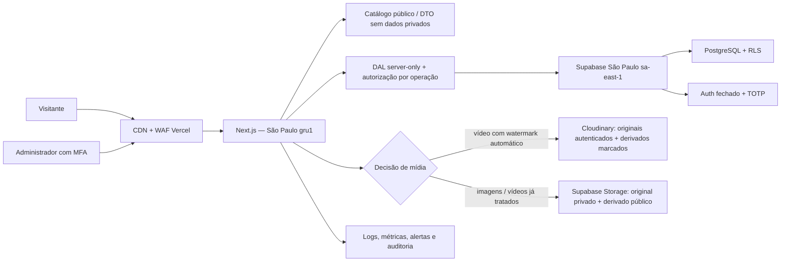

# Pesquisa de arquitetura e segurança — Cris Chaves Corretor de Imóveis

**Data da pesquisa:** 2 de setembro de 2026  
**Status:** pesquisa de referência; a recomendação paga original foi substituída pela decisão orçamentária de 3 de setembro de 2026  
**Escopo:** site público de catálogo imobiliário, captação por formulário/WhatsApp e área administrativa futura

> **Decisão posterior e prevalente:** o único custo autorizado é o domínio. Para a implementação, siga `docs/plano-tecnico-seguranca-e-5-prompts.md`: React Router Framework Mode no Cloudflare Workers Free + Supabase Free, sem Vercel, Cloudinary ou outro plano pago. As seções abaixo sobre Vercel Pro/Supabase Pro permanecem apenas como pesquisa comparativa e possível caminho futuro de upgrade; não autorizam contratação, cadastro de cartão ou ativação de cobrança.

## 1. Resumo executivo

### Recomendação técnica

Construir um **monólito modular gerenciado** com:

- **Next.js 16.x Active LTS**, React 19.x e TypeScript, sempre no patch de segurança mais recente;
- **Vercel Pro**, com Functions na região de São Paulo (`gru1`), para aplicação, CDN, WAF e deploys imutáveis;
- **Supabase Pro** em São Paulo (`sa-east-1`) para PostgreSQL, autenticação e, conforme a decisão de mídia, Storage;
- painel administrativo customizado no próprio Next.js, protegido por autenticação fechada, MFA TOTP, autorização no servidor e PostgreSQL Row Level Security (RLS);
- catálogo público renderizado no servidor/ISR a partir de uma projeção pública que jamais contenha endereço exato, documentos ou dados internos;
- **Cloudinary somente se a marca d'água automática em vídeos for requisito de lançamento**. Para imagens e vídeos já tratados, Supabase Storage em São Paulo é mais simples, regional e econômico;
- OWASP ASVS 5.0 **nível 2** como critério verificável de aceite de segurança, acompanhado de testes negativos de autorização, uploads, publicação e RLS.

Essa solução reduz a quantidade de sistemas, credenciais e superfícies administrativas. Ela também preserva uma saída futura: PostgreSQL é portátil, Next.js é implantável fora da Vercel e os arquivos devem ter rotina de exportação independente.

### Decisões pendentes que bloqueiam o fechamento da arquitetura

1. **Mídia:** a marca d'água automática precisa abranger vídeos no lançamento? Qual volume, duração e tamanho máximos são esperados?
2. **Leads:** o formulário deve apenas encaminhar a mensagem ou também armazenar o contato? Se armazenar, por quanto tempo e quem poderá acessá-lo?
3. **Recuperação:** o cliente aceita perder até 24 horas de dados e aguardar até 4 horas para recuperação? Caso contrário, é preciso contratar PITR e rever custos.
4. **Cookies/analytics:** haverá somente métricas sem cookies ou Google/Meta e campanhas com consentimento?
5. **Identidade pública:** o CRECI-RS deve validar antes do lançamento a apresentação “Cris Chaves Corretor de Imóveis” e `CRECI-RS 98448`.
6. **Operação:** quem será responsável por alertas, atualizações de segurança, restauração de backup e incidentes após o lançamento?

## 2. Contexto encontrado no repositório e no briefing

O repositório ainda está em fase de preparação: contém briefing, referências visuais, logotipo e um design system já produzido no workspace, ainda sujeito à aprovação final, mas não contém aplicação, dependências ou convenção de documentação anterior. Por isso este relatório foi criado em `docs/`.

O briefing atualizado estabelece:

- nome público: **Cris Chaves Corretor de Imóveis**;
- registro: **CRECI-RS 98448**, pessoa física, sem CNPJ;
- atuação em Cidreira, Tramandaí, Balneário Pinhal, Magistério e Quintão;
- catálogo inicia vazio; anúncios de exemplo são apenas testes e precisam ser removidos antes da produção;
- Cris será inicialmente o único proprietário/administrador;
- estados de imóvel: rascunho, disponível, reservado, vendido e arquivado;
- endereço exato é dado privado do administrador; o público vê somente cidade e bairro;
- fotos e vídeos devem receber marca d'água;
- não haverá conta de visitante no lançamento;
- favoritos, alertas, área do comprador, importação/exportação em massa e integrações são futuras;
- retenção de leads, cookies, analytics, domínio, suporte e custos recorrentes ainda não foram decididos.

Consequência arquitetural: não há justificativa atual para microserviços, Elasticsearch, Redis, uma aplicação separada para o painel ou um CMS genérico. PostgreSQL com índices, Next.js e serviços gerenciados atendem o caso com menor risco operacional.

## 3. Comparação das opções

| Opção | Pontos fortes | Custos/riscos | Adequação ao caso |
|---|---|---|---|
| **Next.js + Supabase + admin customizado** | Fluxo e interface exatos para imóveis; MFA e RLS gerenciados; banco PostgreSQL portátil; uma aplicação; separação rigorosa entre dados públicos e privados | Exige construir CRUD, fluxo editorial e testes de autorização | **Recomendada.** Melhor equilíbrio para um único administrador e regras específicas de publicação |
| **Payload CMS + PostgreSQL** | Painel, CRUD, drafts/versions, upload, APIs, auth e access control prontos no mesmo projeto Next.js | Superfície genérica maior; tuning de segurança; MFA não aparece como recurso nativo na documentação de auth e exigiria IdP/estratégia customizada; uploads grandes na Vercel pedem upload direto | **Segunda opção.** Boa se o prazo do painel editorial dominar a decisão; precisa de protótipo de auth/MFA e teste de acesso |
| **WordPress gerenciado** | Painel familiar, ecossistema grande, entrega editorial rápida | Patch contínuo de core/tema/plugins; MFA e várias funções dependem de plugins; maior superfície pública; arquitetura headless duplicaria operações | Só escolher se orçamento/prazo exigir e houver WordPress gerenciado, mínimo de plugins e manutenção contratada |
| **Next.js + API separada em NestJS/Laravel/Django** | Controle máximo e boa base para integrações complexas | Dois deploys, duas camadas de auth/autorização e mais observabilidade/DevOps | Excesso para o lançamento; reavaliar apenas com equipe maior, múltiplos canais ou integrações pesadas |

Fontes oficiais: [Payload — visão geral](https://payloadcms.com/docs/getting-started/what-is-payload), [auth](https://payloadcms.com/docs/authentication/overview), [access control](https://payloadcms.com/docs/access-control/overview), [produção](https://payloadcms.com/docs/production/deployment), [storage adapters](https://payloadcms.com/docs/upload/storage-adapters); [WordPress — hardening](https://developer.wordpress.org/advanced-administration/security/hardening/), [roles/capabilities](https://developer.wordpress.org/plugins/users/roles-and-capabilities/), [MFA](https://developer.wordpress.org/advanced-administration/security/mfa/) e [auto-updates](https://wordpress.org/documentation/article/plugins-themes-auto-updates/).

### Por que não adotar Payload imediatamente

Payload é uma alternativa tecnicamente válida, não uma escolha insegura. Porém, o domínio precisa de poucos fluxos muito específicos: ocultar endereço, exigir autorização escrita, validar registro de incorporação/loteamento, aplicar marca d'água e controlar estados. Um painel sob medida expõe menos recursos desnecessários e permite combinar autorização em três camadas: DAL do Next.js, grants/RLS do PostgreSQL e interface.

Se a prioridade mudar para “painel pronto o mais rápido possível”, deve-se fazer um protótipo Payload antes da decisão final, validando MFA, upload direto de vídeo, acesso por função, trilha de auditoria e comportamento do acesso direto ao PostgreSQL. O fato de Payload suportar PostgreSQL/Supabase não significa que as regras RLS serão automaticamente a barreira principal quando o servidor usar uma conexão privilegiada; essa é uma inferência arquitetural que deve ser testada.

## 4. Arquitetura-alvo

### Limites de confiança

- Tudo que vem do navegador é não confiável, inclusive campos ocultos, identificadores, claims apresentados pelo cliente e MIME informado no upload.
- Middleware/proxy serve para navegação e redução de carga, não como única autorização.
- Cada Server Action, Route Handler e operação no banco deve autenticar e autorizar novamente.
- A chave pública do Supabase pode existir no cliente; a chave `secret` jamais. Chaves secretas ignoram RLS e ficam somente no servidor.
- O cliente nunca consulta a tabela privada de imóveis. A leitura pública usa view/DTO com allowlist de campos.
- Admin e endpoints autenticados usam `Cache-Control: no-store`; nenhuma rota de autenticação deve passar por ISR ou cache compartilhado. A documentação do Supabase alerta que ISR em rotas de auth pode reutilizar `Set-Cookie` entre usuários.

Fontes: [Next.js — autenticação e autorização](https://nextjs.org/docs/app/guides/authentication), [Backend for Frontend](https://nextjs.org/docs/app/guides/backend-for-frontend), [`use server`](https://nextjs.org/docs/app/api-reference/directives/use-server), [Supabase SSR — guia avançado](https://supabase.com/docs/guides/auth/server-side/advanced-guide), [API keys](https://supabase.com/docs/guides/getting-started/api-keys).

## 5. Stack recomendada

| Camada | Recomendação | Observação |
|---|---|---|
| Runtime | Node.js 24 LTS, versão exata fixada e testada | Revalidar LTS antes de iniciar e em cada upgrade maior |
| Web | Next.js 16.x Active LTS + React 19.x + TypeScript strict | Usar sempre o patch de segurança mais recente da linha ativa |
| UI | Design system do projeto + componentes próprios acessíveis | Não adicionar biblioteca pesada sem necessidade comprovada |
| Validação | Schema compartilhado no servidor, por exemplo Zod | Tipagem TS não valida dados em runtime |
| Banco | PostgreSQL gerenciado pelo Supabase | Migrações versionadas; constraints são parte da segurança |
| Auth | Supabase Auth SSR/PKCE, signup público desativado, TOTP obrigatório | Convites apenas por fluxo administrativo no servidor/dashboard |
| Mídia | Supabase Storage ou Cloudinary conforme decisão do §8 | Nunca gravar arquivos no filesystem efêmero da função |
| Hosting | Vercel Pro, Function region `gru1` | Hobby é descrito como não comercial; produção comercial deve usar Pro |
| Testes | Unitários + integração real de RLS + E2E dos fluxos críticos | Critério de aceite inclui testes de negação, não só happy path |

Fontes: [política de suporte do Next.js](https://nextjs.org/support-policy), [Next.js 16](https://nextjs.org/blog/next-16), [versões do React](https://react.dev/versions), [Node.js 24](https://nodejs.org/en/download/archive/v24), [regiões Supabase](https://supabase.com/docs/guides/platform/regions), [regiões Vercel Functions](https://vercel.com/docs/functions/configuring-functions/region), [planos Vercel](https://vercel.com/docs/plans) e [Hobby](https://vercel.com/docs/plans/hobby).

### Política de versões

- Fixar lockfile e versão do runtime; produção instala com `npm ci`.
- Atualizações automáticas podem abrir PR, mas nunca fazer deploy de produção sem testes.
- Patches de segurança críticos: triagem imediata e meta operacional proposta de correção em 24–48 horas.
- Majors: atualizar em tarefa separada, com changelog, testes e rollback.

## 6. Modelo de dados e regras de publicação

### Entidades mínimas

- `properties`: código público, finalidade, tipo, cidade, bairro, preço, dormitórios, vagas, áreas, descrição sanitizada, status e datas.
- `property_private_details`: endereço exato e notas internas; sem política de leitura pública e sem inclusão em DTO.
- `property_publications`: estado editorial, data, autor, autorização escrita confirmada, referência privada do documento e registro condicional de incorporação/loteamento.
- `media_assets`: provedor, asset ID imutável, tipo, estado de processamento, ordem, dimensões/duração, versão e derivados aprovados.
- `admin_users`/`user_roles`: usuário, função, ativo e última revisão de acesso.
- `audit_events`: ator, operação, entidade, ID, horário, request/correlation ID e diff redigido.
- `leads`: somente se a decisão for armazenar; dados mínimos, finalidade, origem, consentimento quando aplicável e data prevista de exclusão.

### Regras no banco e na aplicação

- RLS habilitado e **deny by default** em todas as tabelas expostas pela API.
- Visitante pode ler apenas a projeção `published_properties`, limitada a `status = available` ou à regra editorial aprovada.
- Nenhuma política pública em tabelas privadas, usuários, leads, documentos ou auditoria.
- Admin autenticado e ativo pode executar apenas ações da sua função.
- Restrição de unicidade do código do imóvel; FKs; enums/check constraints; preços e áreas não negativos.
- Transição para publicado falha se faltar autorização escrita confirmada.
- Loteamento/condomínio/incorporação falha na publicação se faltar o registro obrigatório aplicável.
- Venda, reserva, arquivamento e exclusão lógica preservam histórico.
- Upload sem derivado marcado e aprovado não pode ser publicado.

O PostgreSQL aplica RLS antes da consulta normal e, sem policy, adota negação padrão. Proprietários de tabela e funções privilegiadas podem contornar RLS; por isso migrações, funções `security definer` e chaves secretas exigem revisão específica. Fontes: [PostgreSQL Row Security](https://www.postgresql.org/docs/current/ddl-rowsecurity.html) e [Supabase RLS](https://supabase.com/docs/guides/database/postgres/row-level-security).

## 7. Autenticação, sessão e autorização

### Configuração recomendada

- Desativar **Allow new users to sign up**; não existe cadastro público de administrador.
- Criar/invitar o primeiro usuário por operação privilegiada controlada.
- Exigir MFA TOTP (`aal2`) para acessar o painel; bloquear mutações sensíveis sem AAL2.
- Sessão em cookies `Secure`, `HttpOnly` quando a integração permitir, `SameSite=Lax` ou mais restrito; rotação/expiração e logout global após incidente.
- Senha longa e única em gerenciador; recuperação protegida e alertada. Não enviar credencial por briefing, e-mail ou WhatsApp.
- Mensagens de login/recuperação não revelam se um e-mail existe.
- Reautenticar para trocar e-mail, função, MFA, recovery e excluir/transferir dados.
- Bloquear ou revogar imediatamente usuário desativado mesmo que o token anterior ainda esteja dentro do prazo.
- Contas Vercel, Supabase, Cloudinary, registrador e GitHub pertencem ao cliente, cada uma com MFA, recuperação testada e acesso nominal; nada de senha compartilhada.

### Autorização em profundidade

1. Interface oculta ações não permitidas, apenas como UX.
2. DAL `server-only` valida usuário, AAL e permissão para a operação.
3. Server Action/Route Handler trata identificador do recurso como não confiável e autoriza novamente.
4. RLS/grants restringem linhas e operações no banco.
5. Teste automatizado prova que anônimo, usuário sem AAL2, usuário desativado e função errada recebem negação.

Fontes: [Supabase Auth — configuração](https://supabase.com/docs/guides/auth/general-configuration), [usuários e convites](https://supabase.com/docs/guides/auth/users), [MFA](https://supabase.com/docs/guides/auth/auth-mfa), [SSR](https://supabase.com/docs/guides/auth/server-side), [OWASP Session Management](https://cheatsheetseries.owasp.org/cheatsheets/Session_Management_Cheat_Sheet.html) e [NIST SP 800-63B-4](https://pages.nist.gov/800-63-4/sp800-63b.html).

### Decisão futura: passkeys

TOTP é suficiente para o pequeno lançamento, desde que obrigatório. Passkeys resistentes a phishing são uma evolução desejável, mas exigem provedor/estratégia compatível e recuperação cuidadosamente desenhada. Não atrasar o lançamento apenas para construir autenticação própria.

## 8. Fotos, vídeos e marca d'água

### Decisão A — Cloudinary, recomendada se vídeo automático for obrigatório

Fluxo:

1. navegador solicita autorização de upload ao servidor;
2. servidor autentica admin, verifica MFA/permissão e gera assinatura de curta duração;
3. navegador envia diretamente ao Cloudinary;
4. original é armazenado como **authenticated**, não exposto por URL pública;
5. transformação nomeada/eager gera derivado de imagem ou vídeo com marca d'água;
6. webhook assinado atualiza `media_assets` para pronto; publicação só usa o derivado aprovado;
7. Strict Transformations/signed delivery impedem variantes arbitrárias e acesso ao original.

Cuidados:

- API secret nunca vai ao cliente; aceitar apenas presets assinados;
- validar assinatura e timestamp do webhook, tornando processamento idempotente;
- remover EXIF/geolocalização e não pôr endereço, nome pessoal ou telefone em filename/context/metadados;
- manter asset ID e versão no banco; não confiar em URL enviada pelo navegador;
- ativar backup: no Cloudinary ele fica desativado por padrão e cobre originais, não derivados regeneráveis;
- armazenagem Cloudinary padrão fica nos EUA; isso cria transferência internacional a documentar conforme a LGPD/ANPD. Não há região São Paulo padrão divulgada.

Fontes: [referência de transformações](https://cloudinary.com/documentation/transformation_reference), [watermark em vídeo](https://cloudinary.com/documentation/video_layer_watermarking), [upload assinado](https://cloudinary.com/documentation/upload_images), [presets](https://cloudinary.com/documentation/upload_presets), [controle de acesso](https://cloudinary.com/documentation/control_access_to_media), [backup/versionamento](https://cloudinary.com/documentation/backups_and_version_management), [localização do storage](https://cloudinary.com/documentation/developer_onboarding_faq_storage) e [subprocessadores](https://cloudinary.com/trust/subprocessors).

### Decisão B — Supabase Storage, recomendada se vídeo já vier tratado

- buckets privados para originais e públicos/assinados para derivados;
- upload resumível para arquivos maiores ou rede instável;
- imagem é baixada pelo worker, validada, reencodada, metadados removidos e marca d'água incorporada; apenas o derivado vai ao catálogo;
- vídeos precisam chegar já marcados ou serem processados por um worker especializado. As transformações de imagem do Supabase não documentam overlay de marca d'água nem transcodificação de vídeo;
- vantagem: dados e mídia na região São Paulo e um fornecedor a menos;
- desvantagem: processamento de imagem precisa ser implementado e vídeo automático deixa de ser simples.

Fontes: [buckets](https://supabase.com/docs/guides/storage/buckets/fundamentals), [RLS do Storage](https://supabase.com/docs/guides/storage/security/access-control), [uploads resumíveis](https://supabase.com/docs/guides/storage/uploads/resumable-uploads), [limites](https://supabase.com/docs/guides/storage/uploads/file-limits) e [transformações de imagem](https://supabase.com/docs/guides/storage/serving/image-transformations).

### Controles comuns de upload

- allowlist inicial proposta: JPEG/PNG/WebP para imagens; MP4/H.264 e formatos confirmados pelo processador para vídeo;
- não aceitar SVG, HTML, scripts ou executáveis;
- validar extensão, magic bytes, MIME real, dimensões, duração e tamanho; renomear com UUID;
- reencodar imagens e remover metadados antes de publicar;
- limites propostos para validação com o cliente: imagem 15 MB/30 MP; vídeo 500 MB/3 min. Estes números são **pendentes**, não requisitos definidos;
- arquivo fica em quarentena/privado até validação e processamento terminarem;
- nunca servir upload arbitrário no mesmo origin com tipo fornecido pelo usuário;
- para documentos futuros, adicionar antimalware/CDR e armazenamento estritamente privado.

Fonte: [OWASP File Upload Cheat Sheet](https://cheatsheetseries.owasp.org/cheatsheets/File_Upload_Cheat_Sheet.html).

## 9. Formulário, WhatsApp e abuso

### Recomendação

- Coletar somente nome, WhatsApp e e-mail, e tornar e-mail opcional se não for necessário.
- Explicar perto do envio a finalidade e apontar para a política de privacidade.
- Validar e normalizar tudo no servidor; limitar comprimentos; rejeitar campos extras.
- Usar campo honeypot, tempo mínimo razoável, Turnstile e rate limit em camadas.
- A validação do token Turnstile no servidor é obrigatória; token é de uso único e expira em cinco minutos.
- Proposta inicial, sujeita a teste: 3 envios a cada 10 minutos por IP e 10/dia por combinação IP/destino; limitar também globalmente e por fingerprint de baixa invasividade. Responder genericamente e evitar enumeração.
- Não incluir endereço privado nem dados sensíveis no texto pré-preenchido do WhatsApp; enviar código e URL pública do imóvel.
- Não registrar payload completo em logs, analytics ou error tracking.
- Se o lead for enviado por e-mail/WhatsApp sem tabela própria, ele ainda existe nesses fornecedores; a retenção continua precisando de política.

Fontes: [Turnstile — validação server-side](https://developers.cloudflare.com/turnstile/get-started/server-side-validation/), [Vercel WAF rate limiting](https://vercel.com/docs/vercel-firewall/vercel-waf/rate-limiting), [Supabase Auth rate limits](https://supabase.com/docs/guides/auth/rate-limits) e [Supabase CAPTCHA](https://supabase.com/docs/guides/auth/auth-captcha).

### Decisão pendente de leads

- **Opção mínima:** não guardar no banco; encaminhar ao canal de atendimento e manter apenas evento técnico sem dados pessoais.
- **Opção CRM simples:** guardar o mínimo com controle de acesso, prazo automático de exclusão e trilha de consulta/alteração.

Antes de escolher, registrar finalidade, base legal, prazo de retenção, processo de exclusão/correção e responsável por atender o titular.

## 10. Segurança HTTP e aplicação

### Headers e CSP

Configurar e testar:

- HTTPS obrigatório e `Strict-Transport-Security` após confirmar todos os subdomínios;
- `Content-Security-Policy` com `default-src 'self'`, allowlists mínimas, `object-src 'none'`, `base-uri 'self'`, `frame-ancestors 'none'` e destinos explícitos de mídia/analytics;
- iniciar CSP em `Report-Only`, eliminar violações reais e depois impor;
- nonce em rotas dinâmicas/admin quando necessário; a documentação Next.js alerta que CSP com nonce torna a rota dinâmica;
- não aceitar `unsafe-eval` em produção; qualquer `unsafe-inline` precisa de risco documentado e plano de remoção;
- `X-Content-Type-Options: nosniff`, `Referrer-Policy: strict-origin-when-cross-origin` ou mais restrita, `Permissions-Policy` mínima e isolamento de frame;
- admin/auth com `Cache-Control: no-store`; catálogo público pode usar ISR com invalidação após publicação.

Fontes: [Next.js CSP](https://nextjs.org/docs/app/guides/content-security-policy) e [Next.js headers](https://nextjs.org/docs/app/api-reference/config/next-config-js/headers).

### XSS, CSRF, injeção e SSRF

- Usar renderização escapada do React; proibir `dangerouslySetInnerHTML` para descrição do imóvel ou sanitizar com biblioteca auditada e allowlist.
- Consultas parametrizadas/ORM e nenhuma concatenação de SQL.
- Server Actions continuam sendo endpoints públicos: validar input, origem, sessão, permissão e recurso.
- Para mutações por cookie fora do mecanismo protegido pelo framework, usar token CSRF e checagem de `Origin`/`Sec-Fetch-Site`.
- Nenhum importador de imagem por URL no lançamento. Se surgir, bloquear rede privada/metadata, limitar redirects, tamanho e protocolos para evitar SSRF.
- Não retornar stack trace, SQL ou detalhes de política ao cliente.

O React documenta que `dangerouslySetInnerHTML` deve receber apenas conteúdo conhecido e confiável: [React DOM common components](https://react.dev/reference/react-dom/components/common).

## 11. Segredos e ambientes

- Produção, preview e desenvolvimento usam projetos/credenciais separados.
- `.env*` real não entra no Git; só `.env.example` sem valor.
- Usar variáveis sensíveis da plataforma; restringir quem pode ler produção.
- No cliente, somente identificadores deliberadamente públicos. Nada sensível com prefixo `NEXT_PUBLIC_`.
- Preferir chaves novas `publishable`/`secret` do Supabase; planejar retirada das chaves legadas `anon`/`service_role` antes do encerramento anunciado para 2026.
- Chave secreta do Supabase somente em módulos `server-only`, e apenas em rotinas que realmente precisam ignorar RLS, como convite controlado.
- Rotação ao trocar fornecedor/colaborador, em vazamento suspeito e em exercício periódico; manter procedimento, não uma data isolada.
- Webhooks têm segredo separado, assinatura, timestamp e idempotência.
- Registrar domínio/contas em nome do cliente, com MFA e pelo menos dois métodos de recuperação guardados separadamente.

Fontes: [Vercel Environment Variables](https://vercel.com/docs/environment-variables), [Sensitive Environment Variables](https://vercel.com/docs/environment-variables/sensitive-environment-variables) e [Supabase API keys](https://supabase.com/docs/guides/getting-started/api-keys).

## 12. Observabilidade, auditoria e resposta a incidentes

### Três sinais distintos

1. **Telemetria operacional:** latência, erros, disponibilidade, filas/processamento de mídia e uso/custo.
2. **Logs de segurança:** falhas de login/MFA, rate limits, uploads rejeitados, negações de autorização e eventos de segredo/webhook.
3. **Auditoria de negócio:** criação, edição, publicação, mudança de preço/status, arquivamento, alteração de permissão e acesso administrativo a lead.

Regras:

- usar request/correlation ID e horário UTC;
- não logar senha, token, cookie, chave, documento, endereço exato, payload completo de lead ou URL assinada;
- auditoria append-only, com ator, ação, alvo, resultado e diff redigido;
- alertas acionáveis: pico de 401/403/429, nova conta/admin, MFA removido, mutação em massa, erro contínuo de webhook/backup e custo anormal;
- definir responsável e canal de plantão antes da produção;
- manter runbook: conter, preservar evidência, revogar sessões/segredos, corrigir, restaurar, comunicar e revisar.

Fontes: [OWASP Logging Cheat Sheet](https://cheatsheetseries.owasp.org/cheatsheets/Logging_Cheat_Sheet.html), [OpenTelemetry](https://opentelemetry.io/docs/concepts/observability-primer/), [Vercel Observability](https://vercel.com/docs/observability) e [NIST SP 800-61r3](https://csrc.nist.gov/pubs/sp/800/61/r3/final).

## 13. Backup, continuidade e recuperação

### Recomendação inicial

- Supabase **Pro**, com backup automático diário e retenção do plano vigente.
- Exportação lógica mensal criptografada do banco para local fora do Supabase.
- Backup separado de todos os objetos de mídia: backup do banco não representa cópia dos arquivos do Storage. A restauração/clone oficial trata os objetos S3 separadamente.
- Se Cloudinary for escolhido, ativar Auto Backup e manter uma exportação/cópia independente compatível com o plano; derivados marcados podem ser regenerados a partir dos originais e receitas versionadas.
- Infra/configuração em Git: migrations, policies, configuração de buckets, transformações e runbooks.
- Teste trimestral de restauração em ambiente isolado; conferir catálogo, auth, RLS, mídia e integridade antes de declarar sucesso.
- Antes de cada migração grande, gerar backup verificável e definir rollback.

**Objetivo proposto para aprovação:** RPO 24 horas e RTO 4 horas. É uma proposta, não um compromisso até que responsável, teste e orçamento sejam aceitos. Se RPO menor for exigido, avaliar PITR.

Fontes: [Supabase backups](https://supabase.com/docs/guides/platform/backups), [restauração/clone e exclusão de objetos](https://supabase.com/docs/guides/platform/clone-project), [download de objetos](https://supabase.com/docs/guides/storage/management/download-objects), [Cloudinary backup](https://cloudinary.com/documentation/backups_and_version_management), [NIST CSF 2.0](https://www.nist.gov/publications/nist-cybersecurity-framework-csf-20) e [NIST SP 800-34r1](https://csrc.nist.gov/pubs/sp/800/34/r1/upd1/final).

## 14. Privacidade e LGPD

### Antes do lançamento

- Fazer inventário de dados e fluxo por fornecedor: Vercel, Supabase, Cloudinary se usado, e-mail, WhatsApp, analytics e suporte.
- Identificar controlador, operadores, subprocessadores, finalidade, base legal, retenção, local de processamento e mecanismo de transferência internacional.
- Adotar privacy by default: sem conta de visitante, sem tracker opcional antes de consentimento, sem endereço exato público e sem dados pessoais desnecessários.
- Publicar aviso de privacidade claro, canal do titular e política de cookies aderente ao que realmente foi instalado.
- Implementar acesso, confirmação, correção, portabilidade quando aplicável, informação, oposição e eliminação conforme o caso; ter busca por pessoa nos sistemas envolvidos.
- Definir exclusão automática de leads e backups, observando obrigações legais e limitações técnicas documentadas.
- Contratos/DPA e lista de subprocessadores devem ser arquivados e revisados.
- Imagens, credenciais e autorizações do cliente só entram no sistema com finalidade e acesso definidos; redigir foto de documento quando o dado não for necessário.

Fontes: [Lei 13.709/2018 — LGPD](https://www.planalto.gov.br/ccivil_03/_ato2015-2018/2018/lei/l13709compilado.htm), [ANPD — direitos dos titulares](https://www.gov.br/anpd/pt-br/assuntos/titular-de-dados-1/direito-dos-titulares), [guia de cookies](https://www.gov.br/anpd/pt-br/centrais-de-conteudo/materiais-educativos-e-publicacoes/guia-orientativo-cookies-e-protecao-de-dados-pessoais.pdf), [guia de segurança para agentes de pequeno porte](https://www.gov.br/anpd/pt-br/centrais-de-conteudo/materiais-educativos-e-publicacoes/processo-guia-orientativo-sobre-seguranca-da-informacao-para-agentes-de-tratamento-de-pequeno-porte.pdf) e [Resolução ANPD 19/2024 — transferência internacional](https://www.gov.br/anpd/pt-br/acesso-a-informacao/institucional/atos-normativos/regulamentacoes_anpd/resolucao-cd-anpd-no-19-de-23-de-agosto-de-2024).

### Incidentes com dados pessoais

O runbook deve permitir avaliar risco/dano, preservar evidências e cumprir a comunicação à ANPD e aos titulares quando aplicável. A página oficial informa o prazo de **três dias úteis**, ressalvada legislação específica, e manutenção do registro de incidentes por no mínimo cinco anos. Fonte: [ANPD — Comunicado de Incidente de Segurança](https://www.gov.br/anpd/pt-br/canais_atendimento/agente-de-tratamento/comunicado-de-incidente-de-seguranca-cis).

## 15. Publicidade imobiliária — COFECI/CRECI

> Esta seção traduz normas oficiais em controles de produto; a validação final deve ser feita com o CRECI-RS ou assessoria jurídica.

### Requisitos relevantes encontrados

- A Lei 6.530/1978 veda ao corretor anunciar publicamente proposta de transação sem autorização escrita e exige que conste o número de inscrição em todo anúncio profissional.
- Em anúncio de loteamento ou condomínio, deve constar o número de registro correspondente.
- A Resolução-COFECI 1.065/2007 disciplina o nome de divulgação. Para pessoa física, o nome deve ser seguido das expressões admitidas, como “corretor de imóveis”, e do número do CRECI; a expressão obrigatória tem regra de destaque/tamanho. Nome fantasia por pessoa física depende das condições/registro previstos na resolução.
- Informações de preço, disponibilidade e características devem ser verdadeiras e atualizadas; textos sobre usucapião não podem prometer resultado jurídico.

Fontes primárias: [Lei 6.530/1978 — cópia oficial COFECI](https://intranet.cofeci.gov.br/arquivos/legislacao/lei6530_78_a.pdf), [Resolução-COFECI 1.065/2007 consolidada](https://intranet.cofeci.gov.br/arquivos/legislacao/resolucao_1065_07_nova.pdf), [Código de Ética — Resolução 326/1992](https://intranet.cofeci.gov.br/arquivos/legislacao/resolucao_326_1992.pdf) e [CRECI-RS — publicidade e CRECI](https://www.creci-rs.gov.br/siteNovo/noticiasDetalhes.php?noticia=1279).

### Controles a construir

- Cabeçalho/rodapé e cada unidade que funcione como anúncio — card, detalhe, compartilhamento e metadado/arte social — devem preservar identificação profissional e CRECI conforme layout validado.
- Publicação exige `autorizacao_escrita_confirmada = true`, data, responsável e referência privada ao documento; o arquivo não é público.
- Tipos sujeitos a registro exigem campo condicional e validação antes de publicar.
- Alterar preço, status, identificação profissional ou material público gera auditoria.
- Página/arte de placeholder não pode ir a produção; pipeline E2E verifica catálogo inicial vazio e ausência de dados fictícios.
- Antes do go-live, enviar captura das aplicações do nome/CRECI ao CRECI-RS para confirmação de apresentação.

## 16. Supply chain e processo de desenvolvimento

### Controles mínimos

- repositório privado, branch protection, PR obrigatório, revisão e MFA/passkey na organização GitHub;
- lockfile versionado; CI reprodutível com `npm ci`;
- Dependabot/Renovate, secret scanning, CodeQL/SAST e `npm audit` como sinal de triagem, não aprovação automática;
- GitHub Actions de terceiros fixadas por SHA completo e permissões do `GITHUB_TOKEN` mínimas;
- ambientes protegidos e aprovação para produção; previews sem dados/segredos de produção;
- SBOM CycloneDX por release e inventário de serviços/SaaS;
- scan passivo DAST, como ZAP Baseline, e testes E2E de autorização no CI/staging;
- builds imutáveis, rollback de deploy e migrações retrocompatíveis em duas etapas;
- revisão mensal de dependências/contas e revisão trimestral de acessos/backup.

Fontes: [GitHub — secure use of Actions](https://docs.github.com/en/actions/reference/security/secure-use), [GitHub supply-chain security](https://docs.github.com/en/code-security/concepts/supply-chain-security/supply-chain-security), [`npm ci`](https://docs.npmjs.com/cli/commands/npm-ci/), [`npm audit`](https://docs.npmjs.com/cli/audit/), [ZAP Baseline](https://www.zaproxy.org/docs/docker/baseline-scan/) e [NIST SSDF 1.1](https://csrc.nist.gov/pubs/sp/800/218/final).

## 17. Matriz resumida de ameaças e aceite

| Ameaça | Barreira principal | Teste de aceite |
|---|---|---|
| Invasor acessa admin | signup fechado, TOTP AAL2, rate limit e sessão segura | anônimo/AAL1/desativado não acessam página nem endpoint |
| IDOR/BOLA altera outro recurso | autorização por operação + RLS | trocar ID no request retorna negação e não altera banco |
| Chave privilegiada vaza para browser | módulos server-only e scan de bundle/segredos | CI falha se secret aparece em código/artefato cliente |
| Endereço exato vaza | tabela privada + view/DTO allowlist | snapshot/API/cache/SEO não contêm campo privado |
| XSS por descrição/upload | escaping, sanitização e reencode; CSP | payloads XSS não executam; SVG/HTML rejeitados |
| Spam/enumeração | Turnstile, limites em camadas e resposta genérica | carga controlada gera 429 sem revelar contas |
| Anúncio irregular | gate de autorização/registro/CRECI | publicação incompleta falha no servidor e no banco |
| Original sem marca d'água vaza | original privado/authenticated; só derivado público | URL não assinada do original retorna negação |
| Exclusão/falha de fornecedor | export offsite e restore drill | restauração trimestral cumpre RPO/RTO aprovado |
| Dependência comprometida | lockfile, SHA, revisão, SAST/SBOM | pipeline bloqueia segredo, policy crítica e build inconsistente |

Baseline: [OWASP ASVS 5.0.0](https://github.com/OWASP/ASVS/releases/tag/v5.0.0_release) nível 2 e [OWASP Top 10:2025](https://owasp.org/Top10/2025/0x00_2025-Introduction/). O Top 10 orienta ameaças; o ASVS fornece requisitos testáveis e deve ser a referência de aceite.

## 18. Plano em cinco etapas para os prompts de implementação

Cada prompt deve terminar com código revisável, testes e um gate claro. Não colocar todos os recursos em um único prompt.

### Etapa 1 — Fundação, modelo de ameaça e infraestrutura

- iniciar Next/TypeScript, qualidade/CI e ambientes;
- provisionar projetos separados, regiões São Paulo, gestão de secrets e headers iniciais;
- modelar dados, migrations, grants, RLS deny-by-default e view/DTO público;
- documentar ADR da mídia, RPO/RTO e matriz ASVS aplicável.

**Gate:** migration limpa funciona; anônimo não lê/escreve tabelas privadas; catálogo público vazio; nenhum segredo no cliente; preview não usa produção.

### Etapa 2 — Site público e catálogo seguro

- aplicar design system; home, busca/filtros, listagem, detalhe, sobre, contato e páginas legais;
- SSR/ISR, SEO, sitemap, performance e acessibilidade;
- identificação CRECI consistente e nenhuma exibição de endereço exato;
- fixtures apenas em teste, excluídas do build/deploy de produção.

**Gate:** E2E público, acessibilidade, mobile, cache/invalidação e teste automatizado de ausência de dados privados/placeholders.

### Etapa 3 — Autenticação e painel administrativo

- signup fechado, convite seguro, MFA TOTP e sessão no-store;
- CRUD, estados editoriais, validação COFECI, RBAC e auditoria;
- testes negativos de Server Actions, handlers e RLS.

**Gate:** ASVS auth/access subset atendido; AAL1/anônimo/função errada bloqueados; publicação sem autorização/registro falha.

### Etapa 4 — Mídia, leads e operação

- implementar a decisão Cloudinary ou Supabase, upload direto/assinado, quarentena e marca d'água;
- contato/WhatsApp, Turnstile, rate limit e política de retenção escolhida;
- logs redigidos, métricas, alertas, backup separado de mídia e runbooks.

**Gate:** original inacessível, webhook adulterado rejeitado, spam limitado, PII ausente de logs e restauração de amostra comprovada.

### Etapa 5 — Hardening, conformidade e lançamento

- fechar CSP Report-Only para enforcement, WAF, supply-chain e DAST;
- executar matriz ASVS L2 definida, revisão LGPD/COFECI, restore drill e exercício de incidente;
- configurar domínio/DNS, MFA/ownership, orçamento/alertas e rollback;
- remover fixtures e conferir catálogo inicial vazio.

**Gate:** checklist de lançamento assinado, vulnerabilidades críticas/altas resolvidas, rollback e restore testados, responsáveis operacionais definidos.

## 19. Custos e planos — fotografia em 02/09/2026

Valores e limites mudam; revalidar nas páginas oficiais imediatamente antes da contratação.

| Serviço | Plano inicial proposto | Referência atual | Observação |
|---|---|---|---|
| Vercel | Pro | US$ 20/mês por assento na página de preços | Hobby não é adequado ao uso comercial; consumo excedente varia |
| Supabase | Pro | a partir de US$ 25/mês; um projeto pago incluído | Backups diários, retenção, logs e quotas dependem do plano vigente; PITR é adicional |
| Cloudinary | Condicional | Free para prova; Plus aparece por cerca de US$ 99/mês mensal ou US$ 89/mês anual | validar créditos, tamanho máximo, backup externo, vídeo e SLA; pode ser desproporcional ao início |
| Domínio/e-mail/monitoramento | Pendente | depende do fornecedor | propriedade e cobrança devem ficar em nome do cliente |

Fontes: [Vercel Pricing](https://vercel.com/pricing), [Supabase Pricing](https://supabase.com/pricing), [Cloudinary Pricing](https://cloudinary.com/pricing) e [comparação de planos Cloudinary](https://cloudinary.com/pricing/compare-plans).

### Como controlar o custo

- alertas de gasto em todos os fornecedores;
- limites de tamanho/duração e contagem de upload;
- otimização e derivados limitados/nomeados, sem transformação arbitrária;
- cache de catálogo e imagem com invalidação correta;
- não habilitar PITR, analytics pago ou vídeo automático sem requisito e orçamento aprovados;
- revisão mensal de uso, tráfego, armazenamento e créditos.

## 20. Registro final de decisões

### Recomendado agora

- [x] Monólito modular Next.js + Supabase e painel customizado.
- [x] Vercel Pro `gru1` e Supabase Pro `sa-east-1`.
- [x] PostgreSQL RLS, DAL server-only e DTO/view público sem endereço exato.
- [x] Signup administrativo fechado e TOTP obrigatório.
- [x] ASVS 5.0 nível 2 como baseline de aceite.
- [x] Backups independentes de banco e mídia, com teste de restauração.
- [x] Gate de publicação para autorização escrita, CRECI e registros condicionais.

### Pendente de decisão/validação

- [ ] Cloudinary ou Supabase Storage; watermark automático de vídeo no lançamento.
- [ ] Limites/volume/formato/duração de mídia e política de retenção de originais.
- [ ] Armazenar leads ou apenas encaminhar; base legal e retenção.
- [ ] RPO/RTO definitivos e necessidade de PITR.
- [ ] Analytics/cookies/campanhas e mecanismo de consentimento.
- [ ] Validação do nome/CRECI e layouts publicitários pelo CRECI-RS.
- [ ] Provedor e propriedade do domínio, e-mail e suporte.
- [ ] Responsável operacional, SLA de correção, alertas e incidentes.
- [ ] Orçamento recorrente aprovado e teto de consumo.

## 21. Referências centrais

- [OWASP Application Security Verification Standard](https://owasp.org/www-project-application-security-verification-standard/)
- [OWASP ASVS 5.0.0](https://github.com/OWASP/ASVS/releases/tag/v5.0.0_release)
- [OWASP Top 10:2025](https://owasp.org/Top10/2025/0x00_2025-Introduction/)
- [Next.js — Authentication](https://nextjs.org/docs/app/guides/authentication)
- [Supabase — Production checklist](https://supabase.com/docs/guides/deployment/going-into-prod)
- [Supabase — RLS](https://supabase.com/docs/guides/database/postgres/row-level-security)
- [LGPD — Lei 13.709/2018](https://www.planalto.gov.br/ccivil_03/_ato2015-2018/2018/lei/l13709compilado.htm)
- [COFECI — Lei 6.530/1978](https://intranet.cofeci.gov.br/arquivos/legislacao/lei6530_78_a.pdf)
- [COFECI — Resolução 1.065/2007](https://intranet.cofeci.gov.br/arquivos/legislacao/resolucao_1065_07_nova.pdf)
