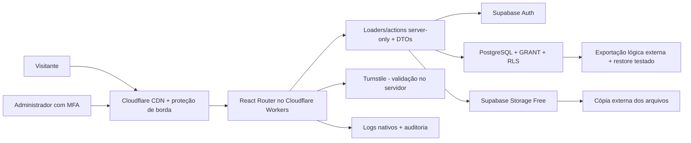

# Plano técnico, segurança e 5 prompts de desenvolvimento

**Projeto:** Cris Chaves Corretor de Imóveis  
**Data da análise:** 3 de setembro de 2026  
**Estado atual:** pré-desenvolvimento; `design_system.html` finalizado e aprovado como contrato visual; aplicação ainda não iniciada

> Decisão atual, considerando que o único custo autorizado é o domínio: construir um monólito modular em **React Router Framework Mode + React + Vite + TypeScript**, executado no **Cloudflare Workers Free**, com **Supabase Free (PostgreSQL, Auth e Storage)**. O catálogo público será somente leitura; o painel será dinâmico, sem cache compartilhado, protegido por convite, MFA obrigatório, autorização em cada loader/action e RLS no banco. Fotos serão otimizadas dentro dos limites gratuitos; vídeos entram somente por URL aprovada e já tratados. **Vercel e Cloudinary não fazem parte do lançamento.**

Este documento é uma recomendação de engenharia, não um parecer jurídico. Bases legais, textos contratuais, política de privacidade e transferências internacionais devem ser validados por profissional habilitado.

## 1. Resumo executivo

Não existe tecnologia que torne um sistema impossível de invadir. O objetivo correto é reduzir a probabilidade, limitar o impacto, detectar abuso cedo e conseguir recuperar o serviço e os dados.

Para este cliente, segurança não deve ser adicionada ao final. Ela precisa definir desde o início:

- quem pode ler e alterar cada tipo de dado;
- quais dados nunca chegam ao navegador público;
- como contas administrativas são criadas e recuperadas;
- como fotos e vídeos são recebidos, processados e publicados;
- como alterações e falhas ficam auditáveis;
- como o sistema volta a funcionar após erro, exclusão ou incidente;
- quais dados pessoais são realmente necessários e por quanto tempo são mantidos.

O padrão verificável recomendado é o **OWASP ASVS 5.0.0 nível 2**. A OWASP indica o nível 2 para a maioria das aplicações; o Top 10 ajuda a priorizar riscos, mas não substitui o ASVS como critério de aceite. Fontes: [OWASP ASVS 5.0.0](https://github.com/OWASP/ASVS/releases/tag/v5.0.0_release), [definição dos níveis do ASVS](https://github.com/OWASP/ASVS/blob/v5.0.0/5.0/en/0x03-What-is-the-ASVS.md) e [OWASP Top 10:2025](https://owasp.org/Top10/2025/0x00_2025-Introduction/).

## 2. O que existe hoje no workspace

### 2.1 Situação técnica

- Ainda não existe aplicação, `package.json`, banco, testes, pipeline, configuração de hospedagem ou repositório Git inicializado na raiz.
- O material é de descoberta: dois briefings, logotipo fotografado, mockup enviado pelo cliente, referências visuais espelhadas, design system e uma biblioteca de componentes/skills.
- O workspace contém centenas de arquivos de sites de terceiros. Eles servem como referência, não como código a ser copiado para produção.
- As capturas `docs-current.png` e `docs-dialog.png` pertencem a outro contexto e não devem orientar este projeto.

### 2.2 Hierarquia recomendada de fontes

1. `briefing_export/briefing - Cris Chaves Imoveis.docx`: fonte funcional mais recente, porque contém respostas e decisões da reunião.
2. `design_system.html`: contrato visual final e obrigatório para o site público e o painel.
3. logotipo vetorial aprovado: fonte oficial da marca; `logo.jpeg` é apenas referência para redesenho.
4. `modelo criado pelo cliente.jpeg`: referência estrutural, nunca fonte de imóveis, preços, endereço ou textos reais.
5. `assets/templates/*`: inspiração de composição e comportamento, sem importar conteúdo, marca, scripts ou ativos de terceiros.
6. `assets/skills/*`: componentes opcionais; só entram se resolverem um problema real, com acessibilidade, movimento reduzido e orçamento de desempenho verificados.

### 2.3 Decisões já confirmadas no briefing mais recente

- Nome pretendido: **Cris Chaves Corretor de Imóveis**.
- Profissional pessoa física e operação sem CNPJ.
- Regiões: Cidreira, Tramandaí, Balneário Pinhal, Magistério e Quintão.
- Um único proprietário/administrador no lançamento; o e-mail administrativo não será público.
- O catálogo começa vazio; Cris fará os cadastros depois de receber acesso.
- Cidade e bairro podem ser públicos; o endereço exato fica restrito ao painel.
- Estados de negócio: disponível, reservado e vendido; também são necessários rascunho e arquivamento.
- Páginas: Início, Imóveis, Detalhe, Sobre, Anuncie seu imóvel, Contato, Privacidade e Termos.
- Visitantes não terão conta no lançamento.
- Favoritos, alertas, importação, duplicação, exportação, CRM e portais ficam para uma fase futura.
- Fotos e vídeos foram citados com marca d'água.

### 2.4 Divergências e bloqueios antes de publicar

| Tema | Evidência atual | Ação obrigatória |
|---|---|---|
| CRECI | Materiais iniciais exibem `89448`; briefing atualizado e design system exibem `98448` | Confirmar no CRECI-RS e registrar a grafia exata que será publicada |
| Nome da marca | Aparecem “Cris Chaves Imóveis” e “Cris Chaves Corretor de Imóveis” | Aprovar uma assinatura pública única |
| WhatsApp | Há número no material inicial, mas o briefing atualizado ainda pede confirmação | Confirmar número, mensagem inicial, horários e responsável |
| Escopo comercial | Venda/aluguel, tipos prioritários, preço e serviços ainda têm perguntas abertas | Fechar antes de definir campos obrigatórios e filtros finais |
| Leads | Não está decidido se o formulário só encaminha ou também armazena contatos | Definir finalidade, base legal, acesso e retenção antes de criar a tabela |
| Vídeo | Marca d'água automática em vídeo exigiria serviço e custo adicionais | No lançamento, aceitar somente URL de YouTube/Vimeo para vídeo previamente tratado e autorizado |
| Domínio e contas | Titularidade e custos recorrentes ainda precisam ser confirmados | Criar tudo em contas da imobiliária e conceder acesso à Sifego por convite |
| Exclusão de imóveis | O cliente confirmou em 3 de setembro de 2026 que histórico e recuperação são obrigatórios | Usar somente arquivamento e soft delete; exclusão definitiva não existe no painel |

O CRECI não é apenas um detalhe visual. A Resolução COFECI 458/95 exige o número de inscrição nos anúncios; também exige autorização escrita para anunciar e, em loteamentos/condomínios, o número de registro ou incorporação. Fontes: [Resolução COFECI 458/95](https://intranet.cofeci.gov.br/arquivos/legislacao/resolucao_0458_95_nova.pdf) e [Resolução COFECI 1.065/07](https://intranet.cofeci.gov.br/arquivos/legislacao/resolucao_1065_07_nova.pdf).

## 3. Escolha das tecnologias

### 3.1 Stack recomendada

| Camada | Escolha | Motivo |
|---|---|---|
| Aplicação | React Router Framework Mode, React, Vite e TypeScript estrito | SSR, loaders/actions de servidor, rotas tipadas e painel no mesmo projeto, com integração oficial de primeira classe no Cloudflare Workers |
| Estilo | CSS variables/tokens extraídos de `design_system.html`, Tailwind CSS e componentes shadcn apenas quando úteis | Mantém consistência sem transformar o design system em uma dependência de runtime |
| Validação | Zod na entrada do servidor; React Hook Form apenas nos formulários administrativos complexos | Um contrato validado no limite de confiança |
| Banco | PostgreSQL gerenciado no Supabase | Modelo relacional adequado a imóveis, filtros, usuários, permissões, mídia, leads e auditoria |
| Autenticação | Supabase Auth, cadastro público desabilitado, convites e TOTP obrigatório (`aal2`) | Evita autenticação artesanal e permite MFA e políticas no banco |
| Autorização | Camada de acesso a dados server-only + RLS/GRANT no PostgreSQL | Duas barreiras independentes contra falhas de autorização |
| Arquivos | Supabase Storage Free para fotos otimizadas; vídeo somente por URL allowlisted | Mantém a operação dentro de 1 GB e evita processamento pesado/cobrança |
| Hospedagem | Cloudflare Workers Free, domínio próprio, CDN, TLS e proteção de borda | Permite uso comercial sem mensalidade inicial; arquivos estáticos não consomem a franquia dinâmica e o plano gratuito oferece até 100 mil requisições dinâmicas/dia |
| Região do banco | Supabase `sa-east-1` (São Paulo), se disponível ao criar o projeto Free | Menor latência para o público e residência primária explícita dos dados |
| Formulário | Route action + Turnstile validado no servidor + limite por IP/rota | Reduz spam e abuso sem criar conta para o visitante |
| Notificação | Provedor transacional com domínio autenticado; conteúdo mínimo e sem segredos | Entrega confiável e separada do e-mail pessoal do administrador |
| Testes | Vitest, Testing Library, Playwright e testes SQL/RLS com Supabase/pgTAP | Cobertura unitária, integração, navegação e autorização negativa |
| Observabilidade | Logs nativos do Cloudflare/Supabase, auditoria de negócio e integração externa somente se aprovada e gratuita | Distingue erro técnico de alteração administrativa sem criar custo recorrente |
| Repositório | GitHub privado, branches protegidas, CI, Dependabot e varredura de segredos | Reduz risco de regressão e cadeia de suprimentos |

Use versões estáveis suportadas no dia em que a implementação começar, fixe-as no lockfile e registre a decisão em um ADR. Não use vinext, OpenNext ou outra adaptação de Next.js neste lançamento sem uma nova decisão arquitetural documentada.

### 3.2 Por que React Router + Cloudflare + Supabase é a melhor opção agora

- O projeto já está sendo preparado em torno de React, TypeScript e tokens CSS; React Router mantém essa base sem amarrar a aplicação a uma hospedagem paga.
- O modo framework oferece SSR, rotas, loaders e actions no servidor, atendendo SEO, formulários e painel administrativo no mesmo projeto.
- PostgreSQL modela filtros e relações melhor que um banco de documentos neste caso.
- Supabase reduz a infraestrutura a manter e combina autenticação, banco, Storage e políticas RLS.
- A área administrativa tem fluxo específico e relativamente pequeno; um painel próprio evita adaptar o cliente a um CMS genérico.
- O Cloudflare Workers possui integração oficial com React Router e plano gratuito; o Supabase oferece banco em `sa-east-1`. Fontes: [React Router no Cloudflare Workers](https://developers.cloudflare.com/workers/framework-guides/web-apps/react-router/), [limites do Workers](https://developers.cloudflare.com/workers/platform/limits/) e [regiões Supabase](https://supabase.com/docs/guides/platform/regions).

### 3.3 Alternativas consideradas

| Alternativa | Vantagem | Por que não é a primeira escolha |
|---|---|---|
| Next.js + Payload CMS | Admin, autenticação, drafts, versões e uploads prontos | Maior acoplamento ao CMS e necessidade de complementar MFA/infra conforme o nível de segurança escolhido |
| Directus/Strapi | Painel e permissões configuráveis | Outro serviço e outra superfície administrativa; customização visual/fluxos e operação adicionais |
| WordPress + plugins | Ecossistema e edição conhecidos | Muitos plugins, atualizações e superfícies expostas para um painel que será simples e específico |
| Backend Node/Prisma/Auth construído do zero | Controle total | Mais código crítico, mais tempo e maior risco sem benefício proporcional |
| Firebase | Operação gerenciada | O modelo de dados e filtros deste catálogo são naturalmente relacionais; Postgres oferece caminho mais direto |

Payload continua sendo uma boa segunda opção se a prioridade mudar para “entregar o painel o mais rápido possível” e a equipe aceitar sua operação. Ele oferece painel, controle de acesso, drafts e versões oficialmente: [Admin Panel](https://payloadcms.com/docs/admin/overview), [Access Control](https://payloadcms.com/docs/access-control/overview) e [Drafts](https://payloadcms.com/docs/versions/drafts).

### 3.4 Decisão de mídia

**Padrão econômico recomendado:** Supabase Storage para originais privados e derivados públicos de fotos. No upload, validar arquivo, remover EXIF/GPS, reencodar e gerar tamanhos responsivos com marca d'água. Vídeos entram como links de YouTube/Vimeo e já devem chegar tratados.

**Fora do escopo gratuito:** upload e marca d'água automática de vídeo. Se isso se tornar obrigatório, interromper a implementação, estimar armazenamento/processamento e aprovar formalmente um serviço pago antes de alterar a arquitetura.

## 4. Arquitetura recomendada



### 4.1 Separação público/privado

- O navegador público só recebe um DTO ou `public_properties` com campos explicitamente permitidos.
- Rascunhos, endereço exato, notas internas, usuários, auditoria, leads e autorização do proprietário nunca aparecem nesse DTO.
- O painel é dinâmico, `no-store`, `noindex` e sem conteúdo administrativo em cache compartilhado.
- Um loader pode redirecionar cedo, mas não é a barreira de segurança. Cada loader/action e endpoint autentica e autoriza novamente; toda action deve ser tratada como endpoint público.
- Toda consulta sensível passa por módulos `.server.ts`; componentes recebem somente DTOs mínimos.

### 4.2 Modelo de dados inicial

**`properties`**

- `id`, `public_code`, `slug`;
- `purpose`, `property_type`;
- `publication_status`: `draft | published | archived`;
- `deal_status`: `available | reserved | sold`;
- preço em centavos e regra de exibição (`show | on_request`);
- cidade, bairro, descrição em texto, áreas, dormitórios, suítes, banheiros, vagas;
- `featured`, `published_at`, `archived_at`, `deleted_at`, `created_by`, `updated_by`, timestamps e versão de concorrência.

**`property_private_details`**

- endereço exato, coordenada exata, nome/contato do proprietário, notas internas e comprovação/autorização de anúncio;
- nenhuma permissão para `anon`.

**`property_media`**

- propriedade, tipo, identificador do provedor, ordem, texto alternativo, hash, dimensões, tamanho, estado de processamento e versão da marca d'água.

**`admin_members`**

- `user_id`, papel `owner | editor`, status e datas;
- somente `owner` convida, altera papéis ou desativa usuários;
- o usuário não pode promover a si próprio por uma operação comum.

**`leads`**, somente se aprovados

- propriedade relacionada, nome, canal mínimo de retorno, origem, consentimento/aviso apresentado, `retention_until` e timestamps;
- evitar texto livre desnecessário e não copiar o conteúdo integral para logs.

**`audit_events`**

- ator, ação, entidade, ID, resumo seguro da alteração, IP truncado/normalizado quando necessário, request ID e data;
- append-only; sem senhas, tokens, cookies, segredos ou dados pessoais integrais.

Manter `publication_status` separado de `deal_status` evita combinações ambíguas: um imóvel pode estar publicado e reservado, vendido e publicado como portfólio, ou arquivado independentemente do negócio.

## 5. Modelo de ameaças e controles

| Risco | Controle de projeto | Como provar |
|---|---|---|
| Acesso a rascunho/endereço por URL ou API | DTO público explícito, schema privado, GRANT mínimo e RLS default-deny | Testes `anon` para `SELECT`, IDs aleatórios e campos privados |
| Conta administrativa comprometida | Convite, conta individual, MFA `aal2`, rate limit, aviso de novo login e recuperação controlada | E2E de login/MFA; mutação negada em `aal1` |
| Usuário altera papel/permissão | Operação owner-only, RLS e função privilegiada mínima | Testes editor → owner e auto-promoção devem falhar |
| Route action chamada diretamente | Autenticação, autorização e Zod dentro de toda ação | Testes HTTP diretos sem interface |
| XSS em descrição, título ou mídia | Texto puro por padrão, sanitização allowlist se HTML for indispensável, CSP, sem `dangerouslySetInnerHTML` | Payloads XSS em testes e CSP sem violações críticas |
| CSRF em mutações | Mesma origem, verificação Origin/Host, proteção do framework e token quando aplicável | Requisições cross-origin devem falhar |
| Arquivo malicioso ou vazamento de GPS | Allowlist, assinatura real, limites, nome aleatório, quarentena, reencodificação e remoção de EXIF; sem SVG | Testes de MIME falso, arquivo grande, polyglot e EXIF GPS |
| Spam/DoS/custo abusivo | Turnstile no formulário, limites por IP/rota/usuário, WAF e limites de corpo/upload | Testes 429, token falso/reutilizado e monitoramento em modo log antes de bloquear |
| Vazamento de secret/service key | `server-only`, ambientes separados, scanner de segredos e rotação | Inspeção do bundle, push protection e teste de configuração |
| Exclusão acidental | Arquivamento, soft delete, confirmação reforçada, auditoria e backup | Restauração de registro e teste periódico de restore |
| Dependência comprometida | Lockfile, revisão de dependência, Dependabot, CodeQL/SAST, Actions fixadas por SHA | Pipeline falha em vulnerabilidade crítica ou segredo |
| Dados pessoais em logs/previews | Redação de PII, dados sintéticos e ambientes isolados | Inspeção automatizada de logs e preview sem dados reais |

Uploads exigem defesa em profundidade: extensão e `Content-Type` não bastam; é preciso assinatura do arquivo, limites, nome gerado e reprocessamento. Fonte: [OWASP File Upload Cheat Sheet](https://cheatsheetseries.owasp.org/cheatsheets/File_Upload_Cheat_Sheet.html).

## 6. Controles de segurança não negociáveis

### 6.1 Autenticação e sessão

- cadastro público desabilitado;
- criação por convite e contas individuais;
- MFA TOTP obrigatório e política que exige `aal2` nas mutações administrativas;
- segundo fator de recuperação guardado em local separado e procedimento de recuperação documentado;
- senha longa, compatível com gerenciador e limitada contra tentativa automatizada;
- resposta de login/recuperação que não revele se o e-mail existe;
- logout e desativação invalidam sessões;
- reautenticação/MFA recente para trocar papel, e-mail, MFA ou excluir definitivamente;
- cliente Supabase criado por requisição no SSR; nunca compartilhar sessão entre requisições.

O Supabase permite usar o nível `aal2` no JWT e inclusive torná-lo parte de uma política RLS restritiva. Fonte: [MFA no Supabase](https://supabase.com/docs/guides/auth/auth-mfa).

### 6.2 Banco e autorização

- RLS habilitado em toda tabela exposta;
- `GRANT` mínimo por papel, além das políticas RLS;
- política pública somente para leitura de anúncios publicados e colunas públicas;
- tabelas privadas sem acesso `anon`;
- cada operação testada para `anon`, autenticado sem papel, editor e owner;
- chaves `secret`/`service_role` somente no servidor e usadas no menor número possível de módulos;
- migrations e tipos TypeScript versionados; nenhuma alteração manual apenas no dashboard;
- nenhum filtro ou `user_id` enviado pelo cliente é aceito como prova de autorização.

O Supabase ressalta que uma tabela exposta sem RLS pode ficar acessível e que a chave de serviço ignora RLS. Fontes: [RLS](https://supabase.com/docs/guides/database/postgres/row-level-security) e [segurança dos dados](https://supabase.com/docs/guides/database/secure-data).

### 6.3 Navegador e HTTP

- HTTPS e HSTS;
- CSP em `Report-Only` durante integração e depois em modo obrigatório;
- `object-src 'none'`, `base-uri 'self'`, `frame-ancestors 'none'`, `form-action 'self'` e allowlist estrita para scripts, imagens e conexões;
- `X-Content-Type-Options: nosniff`;
- `Referrer-Policy: strict-origin-when-cross-origin`;
- `Permissions-Policy` bloqueando câmera, microfone e geolocalização se não forem usados;
- sem CORS aberto; sem ecoar headers de entrada;
- não expor headers desnecessários de tecnologia;
- limites pequenos de corpo; uploads autenticados seguem fluxo dedicado e não passam por actions genéricas.

Gere nonce por resposta quando necessário e configure o CSP tanto no documento SSR quanto no cabeçalho. Fonte: [segurança e CSP no React Router](https://reactrouter.com/how-to/security).

### 6.4 Formulários e abuso

- Turnstile validado no servidor; token cliente isolado não protege;
- limite por IP/rota e, no painel, por usuário;
- honeypot pode complementar, nunca substituir o controle principal;
- payload pequeno e validado; campos mínimos;
- mensagem genérica de sucesso;
- deduplicação e idempotência quando a requisição puder ser repetida;
- WAF primeiro em modo log, depois deny/challenge/rate-limit com métricas de falso positivo.

Fontes: [validação server-side do Turnstile](https://developers.cloudflare.com/turnstile/get-started/server-side-validation/) e [Rate Limiting da Cloudflare](https://developers.cloudflare.com/waf/rate-limiting-rules/).

### 6.5 Segredos, repositório e CI

- repositório privado em conta da empresa;
- `.env*` ignorado, `.env.example` sem valores reais;
- segredos diferentes em local, preview e produção;
- previews protegidos e sem dados de produção;
- branch principal protegida, PR e checks obrigatórios;
- `pnpm-lock.yaml` congelado no CI;
- Dependabot, análise estática, secret scanning/push protection e revisão de dependências;
- Actions de terceiros fixadas por SHA e `GITHUB_TOKEN` com permissões mínimas;
- rotação documentada de chaves de banco, mídia, e-mail e Turnstile.

Fontes: [GitHub - segurança de dependências](https://docs.github.com/en/code-security/how-tos/secure-your-supply-chain/secure-your-dependencies), [CodeQL](https://docs.github.com/en/code-security/concepts/code-scanning/setup-types) e [proteção de previews da Cloudflare](https://developers.cloudflare.com/pages/configuration/preview-deployments/).

### 6.6 Backup, auditoria e incidentes

- como o Supabase Free não fornece backup automático, executar dump lógico off-site regular e criptografado, com agenda e responsável definidos;
- backup/versionamento separado dos objetos de Storage, porque backup do banco não é backup dos arquivos;
- RPO e RTO aprovados; sugestão inicial: RPO de 24 h e RTO de 4 h, a confirmar com o cliente e validar por teste de restauração;
- teste de restauração antes do lançamento e depois trimestralmente;
- auditoria de login, falhas, negações, papel/MFA, criação, publicação, arquivamento, exclusão, upload e configuração;
- alertas para falhas repetidas, alteração de MFA/papel e picos anormais;
- runbook de incidente com responsáveis, contenção, rotação, preservação de evidências, recuperação e comunicação.

O Supabase recomenda que projetos gratuitos exportem regularmente os dados com `supabase db dump` e mantenham a cópia fora da plataforma. Backups do banco não incluem os objetos do Storage, portanto as imagens precisam de cópia separada. Fonte: [Supabase Database Backups](https://supabase.com/docs/guides/platform/backups).

## 7. LGPD e privacidade desde a concepção

A LGPD exige medidas técnicas e administrativas desde a concepção do serviço. Fonte: [Lei 13.709/2018, arts. 46 e seguintes](https://planalto.gov.br/ccivil_03/_ato2015-2018/2018/lei/l13709.htm).

Antes de criar `leads`, analytics ou automações, registrar para cada dado:

- finalidade;
- base legal validada;
- origem e aviso apresentado;
- pessoas e fornecedores com acesso;
- localização/transferência;
- retenção e descarte;
- como o titular pede acesso, correção ou exclusão.

Aplicação prática:

- Cris/imobiliária tende a ser a controladora; Sifego e fornecedores podem atuar como operadores conforme o contrato e a operação real;
- pedir no formulário apenas o necessário para retorno;
- não publicar e-mail administrativo, endereço exato, CPF, QR Code, matrícula, chave de autenticação ou dados de certificados;
- remover EXIF/GPS de fotos públicas;
- não copiar leads para múltiplas planilhas e caixas postais sem necessidade;
- analytics e pixels não essenciais só depois de decisão, transparência e mecanismo adequado de escolha;
- manter inventário de subprocessadores e DPAs;
- incidentes relevantes envolvendo dados pessoais podem exigir comunicação à ANPD e aos titulares em 3 dias úteis; manter os registros pelo período regulamentar.

Fontes: [guia ANPD para pequenos agentes](https://www.gov.br/anpd/pt-br/centrais-de-conteudo/materiais-educativos-e-publicacoes/anonimizado___guia_orientat-_seg_da_inf_p_atpp.pdf) e [Comunicação de Incidente de Segurança](https://www.gov.br/anpd/pt-br/canais_atendimento/agente-de-tratamento/comunicado-de-incidente-de-seguranca-cis).

## 8. Plano de execução em cinco etapas

| Etapa | Resultado | Gate para avançar |
|---|---|---|
| 1. Fundação | Repositório, stack, arquitetura, tokens, qualidade, CI e decisões registradas | Build/testes verdes; nenhum segredo; ADR aprovado |
| 2. Dados e segurança | Schema, migrations, Auth/MFA, RLS, DAL, mídia e testes negativos | Matriz de acesso passa; `anon` não lê rascunho/privado; backup definido |
| 3. Site público | Páginas, catálogo, filtros, detalhe, WhatsApp, formulário, SEO e acessibilidade | Somente publicados aparecem; endereço exato não vaza; vazio real funciona |
| 4. Painel | Login/MFA, CRUD, estados, mídia, usuários, auditoria e invalidação do catálogo | Todos os fluxos e negações E2E passam; alterações auditadas |
| 5. Hardening e lançamento | ASVS L2, WAF, CSP, observabilidade, restauração, conteúdo, performance e publicação | Checklist de lançamento assinado; restore testado; zero placeholder público |

Cada etapa deve terminar em um commit pequeno e revisável, documentação de handoff e lista explícita do que ficou pendente. Segurança crítica não pode ser “TODO”.

## 9. Os cinco prompts prontos

Os prompts abaixo pressupõem que o agente trabalha no mesmo workspace e deve preservar os arquivos já existentes. Execute um por vez. Só passe ao próximo quando o gate estiver atendido. Em caso de conflito com a pesquisa anterior, **este documento prevalece** quanto à stack, hospedagem, mídia e orçamento.

Para encaminhar as etapas individualmente sem expor o agente aos prompts futuros, use os atalhos em `docs/prompts/`, começando por `docs/prompts/01-fundacao.md`.

### Prompt 1 — Fundação, arquitetura e contrato técnico

```text
Você é o engenheiro principal do projeto Cris Chaves Corretor de Imóveis. Trabalhe no workspace atual e implemente somente a ETAPA 1: fundação, arquitetura e contrato técnico.

Antes de alterar qualquer arquivo:
1. Leia por completo `docs/plano-tecnico-seguranca-e-5-prompts.md`, `docs/pesquisa-arquitetura-seguranca.md` se existir, o briefing mais recente em `briefing_export/`, o `design_system.html` final e quaisquer instruções `AGENTS.md` aplicáveis.
2. Inventarie o workspace e preserve todos os materiais do cliente, referências e mudanças de outros agentes.
3. Trate o briefing atualizado como fonte funcional e `design_system.html` como contrato visual final. Não transforme imóveis, preços, contatos, imagens ou endereços demonstrativos em dados reais.
4. Registre as divergências de nome público e CRECI como bloqueios de publicação; não invente a resposta.

Objetivo:
- Inicializar um repositório Git na raiz se ainda não existir.
- Criar a aplicação com versões estáveis de React Router Framework Mode, React, Vite, TypeScript em modo strict e pnpm, usando o template oficial do Cloudflare Workers e lockfile congelável.
- Organizar um monólito modular, separando site público, admin, módulos de domínio, módulos `.server.ts`, validações, UI e testes. Loaders leem; actions alteram; componentes nunca acessam segredos.
- Extrair de `design_system.html` uma fonte canônica versionada de tokens e componentes, preservando exatamente: Geist/Geist Mono, paleta e variáveis semânticas, tema padrão `horizonte`, cinco temas alternativos, esquemas light/dark/system, grid de 12 colunas, raios, sombras, foco visível, estados e escalas tipográficas. O HTML é referência, não dependência de runtime.
- Preparar os componentes-base demonstrados no design system sem construir as páginas finais: botões, icon button, badges/status, campos, alertas, tabs, disclosure, paginação, breadcrumb, spinner, skeleton, empty state, modal, drawer, card de imóvel e estruturas de navegação pública/admin. Cada componente deve possuir estados normal, hover quando aplicável, active, focus-visible, disabled, loading, erro e sucesso previstos no arquivo.
- Configurar lint, formatação, typecheck, testes unitários, Playwright, build, verificação de acessibilidade básica e CI.
- Criar `.gitignore`, `.env.example` sem valores reais, política de variáveis por ambiente e proteção contra importação de módulos server-only no cliente.
- Configurar `wrangler.jsonc` sem segredos, execução local compatível com Workers e orçamento do plano Free: 100 mil requisições dinâmicas/dia, 10 ms de CPU por invocação e ativos estáticos fora dessa franquia. Não ativar nenhum recurso com cobrança automática.
- Registrar ADRs para React Router + Cloudflare Workers Free, Supabase Free, região do banco, separação público/admin, RLS como barreira final, catálogo dinâmico sem cache inseguro, backup manual e vídeo apenas por URL tratada.
- Criar documentação curta de setup e comandos, sem depender de configuração manual não versionada.

Restrições:
- Não criar autenticação artesanal.
- Não criar banco de produção nem usar credenciais reais nesta etapa.
- Não implementar o painel ou o site final ainda.
- Não usar Next.js, Vercel, vinext, OpenNext, Cloudinary ou serviço pago. Se uma exigência não couber no plano gratuito, documente-a como bloqueio e não cadastre cartão nem aceite cobrança.
- Não instalar bibliotecas visuais genéricas que contradigam o design system.
- Não copiar HTML/JS/CSS de Resider, Apple, Digital Architect ou outros espelhos para a aplicação.
- Não adicionar analytics, pixels, chat ou serviços externos não aprovados.
- Use OWASP ASVS 5.0.0 nível 2 como critério futuro e crie uma matriz inicial de requisitos aplicáveis.

Entregáveis:
- aplicação inicial executável;
- estrutura de pastas e fronteiras documentadas;
- CI com lint, typecheck, testes e build;
- ADRs e matriz ASVS inicial;
- checklist de decisões pendentes;
- relatório final com arquivos alterados, comandos executados, resultados e riscos restantes.

Gate de aceite:
- instalação reproduzível a partir do lockfile;
- lint, typecheck, testes e build passam;
- nenhum segredo ou dado pessoal aparece no repositório/fixture;
- tokens do design system têm uma fonte canônica;
- temas e componentes-base reproduzem o contrato do `design_system.html`, inclusive teclado, foco e `prefers-reduced-motion`;
- imports cliente/servidor estão separados e módulos `.server.ts` não entram no bundle do navegador;
- preview/build executam no runtime local do Cloudflare Workers e o tamanho/CPU estimados cabem no plano Free;
- nenhuma etapa seguinte foi antecipada com implementação improvisada.
```

### Prompt 2 — Banco, autenticação, RLS e mídia segura

```text
Implemente somente a ETAPA 2 do projeto Cris Chaves: dados, autenticação, autorização e fundação segura de mídia. Preserve a etapa anterior e todas as mudanças existentes.

Leitura obrigatória antes de agir:
- `docs/plano-tecnico-seguranca-e-5-prompts.md`;
- `docs/pesquisa-arquitetura-seguranca.md` se existir;
- ADRs e matriz ASVS;
- briefing atualizado;
- `design_system.html` para nomes, estados e linguagem do domínio;
- código e testes atuais;
- documentação oficial atual de React Router, Cloudflare Workers e Supabase para qualquer API sensível.

Objetivo:
1. Configurar desenvolvimento local Supabase com migrations versionadas, tipos TypeScript gerados e seed exclusivamente sintético.
2. Modelar `properties`, `property_private_details`, `property_media`, `admin_members`, `audit_events` e tabelas auxiliares. Criar `leads` somente se a decisão de armazenamento/retenção estiver registrada; caso contrário, deixar uma ADR e interface desativada.
3. Separar `publication_status` (`draft`, `published`, `archived`) de `deal_status` (`available`, `reserved`, `sold`), usar soft delete, timestamps, autoria e controle de concorrência.
4. Criar uma projeção/consulta pública com allowlist de colunas. Endereço exato, coordenada exata, autorização, notas, usuários, auditoria e leads nunca entram nela.
5. Configurar Supabase Auth com cadastro público desabilitado, convite, papéis `owner` e `editor`, MFA TOTP e exigência de `aal2` para mutações administrativas.
6. Implementar uma Data Access Layer em módulos `.server.ts`, DTOs mínimos e schemas Zod. Todo loader, action ou endpoint deve autenticar, checar MFA quando aplicável e autorizar a operação internamente.
7. Aplicar GRANT mínimo e RLS default-deny em todas as tabelas expostas. Evitar chave secret/service-role; quando inevitável, isolá-la em módulo server-only e justificar cada uso.
8. Implementar a base no Supabase Storage Free: objetos privados durante o envio, publicação controlada por política, upload autenticado, nomes aleatórios e metadados. Aceitar somente JPEG/WebP previamente reencodados e otimizados no navegador administrativo; rejeitar SVG, GIF, executáveis, MIME/extensão divergentes, EXIF/GPS, dimensões e bytes fora dos limites. Definir também quantidade máxima por imóvel e orçamento total de 1 GB.
9. Vídeos não serão enviados nem processados. Armazenar somente URL validada de provedor allowlisted (YouTube/Vimeo) para vídeo previamente tratado e autorizado. Não instalar Cloudinary nem outro serviço pago.
10. Criar auditoria append-only para operações administrativas sem registrar tokens, cookies, segredos ou dados pessoais integrais.

Testes obrigatórios:
- `anon` lê somente anúncios publicados e colunas públicas;
- `anon` não cria, altera, exclui nem lista objetos privados;
- usuário autenticado sem papel não acessa o admin;
- editor não gerencia usuários, papéis nem exclusão definitiva; owner também não possui exclusão definitiva no painel;
- owner pode executar somente operações previstas;
- sessão `aal1` não faz mutações administrativas;
- rascunho, endereço exato, leads e auditoria não vazam por ID direto, filtro, RPC, Storage ou erro;
- validação rejeita enum, preço, slug, UUID, campos extras e payloads inválidos;
- migrations sobem do zero e todos os testes RLS/pgTAP passam.

Restrições:
- Não usar o dashboard como única fonte de alterações de schema.
- Não usar dados reais em dev/CI/preview.
- Não colocar token/JWT/secret em localStorage, logs ou bundle.
- Não confiar em middleware, botão oculto, e-mail do formulário ou `user_id` do cliente como autorização.
- Não usar APIs Node incompatíveis com o runtime Workers nem aumentar limites/custos sem ADR e aprovação humana.
- Não implementar UI final do site ou painel ainda.

Entregáveis e gate:
- migrations, políticas, tipos, DAL, schemas, testes e documentação da matriz de acesso;
- diagrama do modelo e inventário de dados/LGPD;
- rotina reproduzível de `supabase db dump`, cópia externa criptografada do banco e cópia separada dos objetos; não alegar backup automático no plano Free;
- todos os testes positivos e negativos verdes;
- prova de que o bundle cliente não contém chaves privilegiadas;
- relatório de handoff com decisões pendentes, especialmente leads e vídeo.
```

### Prompt 3 — Site público, catálogo e conversão segura

```text
Implemente somente a ETAPA 3: site público do projeto Cris Chaves. Use a fundação e os contratos existentes; não enfraqueça RLS, DTOs ou separação server/client.

Antes de editar:
- leia o briefing atualizado, o `design_system.html` final, o plano técnico, a pesquisa, ADRs, código e testes;
- confirme quais decisões de marca/CRECI/contatos já foram aprovadas;
- onde algo ainda estiver pendente, use configuração segura ou marcador de bloqueio de publicação, nunca dado inventado.

Objetivo funcional:
- Implementar Início, Imóveis, Detalhe do imóvel, Sobre Cris, Anuncie seu imóvel, Contato, Privacidade e Termos.
- Implementar catálogo vazio real e, apenas em dev/teste, fixtures claramente sintéticas.
- Criar filtros por URL e validados no servidor para finalidade, tipo, cidade, bairro, faixa de preço, dormitórios, vagas e código; só adicionar filtros extras confirmados.
- Mostrar somente imóveis `published` e campos do DTO público. Nunca consultar ou serializar endereço/coordenada exatos.
- No detalhe, criar galeria acessível, dados, descrição, mídias aprovadas e CTA de WhatsApp com código + URL canônica, sem dados internos.
- Implementar formulário mínimo com Zod em uma route action, Turnstile validado via Siteverify, rate limit compatível com o plano gratuito, idempotência e resposta sem enumeração. Armazenar lead somente se a decisão LGPD estiver aprovada; caso contrário, encaminhar pelo fluxo aprovado sem retenção extra.
- Gerar metadata, canonical, sitemap, robots e JSON-LD sem vazar endereço exato nem usar schema/dado falso.
- Consultar o catálogo em loaders usando somente a projeção pública. Não implementar cache compartilhado de HTML/dados até existir invalidação segura; ativos com hash podem usar cache longo.
- Reproduzir o `design_system.html` como contrato visual: Geist/Geist Mono, tema `horizonte` inicial, temas alternativos, light/dark/system persistidos, header, busca, filtros, cards, detalhe, estados vazio/carregando/erro, CTAs, grid e conteúdo. Preserve as variáveis semânticas; não copie estilos inline nem JavaScript demonstrativo para a aplicação.
- Implementar responsividade conforme o design system: conteúdo útil desde 320 px, filtros em sheet/drawer no móvel, cards legíveis, ação principal prioritária e nenhuma função essencial dependente de hover.
- Preservar o contrato de motion: transições de 220–320 ms, respostas imediatas, movimento interrompível, horizonte como única animação ambiente e desligamento com `prefers-reduced-motion`.
- Garantir teclado, ordem de foco, foco visível, landmarks, nomes acessíveis, mensagens anunciáveis e contraste WCAG AA em todos os temas e esquemas.

Segurança e privacidade:
- conteúdo administrativo deve chegar como texto; não use `dangerouslySetInnerHTML` com entrada do painel;
- CSP inicialmente em Report-Only com relatório analisável; adicionar HSTS, nosniff, Referrer-Policy, Permissions-Policy e frame-ancestors;
- sem analytics/pixels/cookies não essenciais antes de aprovação;
- externos abrem com proteção adequada; iframe/video somente de provedores allowlisted;
- não registrar conteúdo integral do formulário, token Turnstile ou PII em logs;
- preservar a cidade/bairro públicos e ocultar completamente o endereço exato também no HTML, JSON, source map e JSON-LD.

Testes obrigatórios:
- catálogo vazio, filtros, paginação, detalhe inexistente e imóvel arquivado/rascunho;
- WhatsApp contém somente código e URL esperados;
- Turnstile válido, inválido, expirado e reutilizado;
- rate limit retorna 429 sem derrubar usuários normais;
- payloads XSS e campos extras não executam nem vazam;
- navegação completa por teclado, leitores de tela básicos e reduced motion;
- comparação visual automatizada ou screenshots de referência para os padrões públicos do `design_system.html`, em mobile e desktop e nos dois esquemas;
- responsivo em 320, 375, 768, 1024, 1280 e 1440 px sem overflow horizontal;
- Lighthouse/Core Web Vitals dentro dos orçamentos registrados.

Restrições:
- Não implementar login de visitante, favoritos, CRM, importação ou recursos de fase futura.
- Não publicar endereço, placeholder, imóvel, preço, depoimento, certificado ou contato não aprovado.
- Não copiar textos/imagens dos sites de referência.
- Não instalar biblioteca de componentes que substitua a linguagem do design system, não carregar fontes/ativos de domínios espelhados e não usar imagens demonstrativas do HTML em produção.

Gate:
- site público fiel ao design system, verificado visualmente, e funcional sem JavaScript para conteúdo essencial;
- somente dados publicados e públicos aparecem;
- testes unitários, integração, E2E, a11y, lint, typecheck e build passam;
- relatório de CSP Report-Only revisado;
- build e rotas dinâmicas cabem nos limites do Cloudflare Workers Free, sem recurso faturável habilitado;
- lista explícita de conteúdos que ainda bloqueiam produção.
```

### Prompt 4 — Área administrativa e operação completa

```text
Implemente somente a ETAPA 4: área administrativa privada do projeto Cris Chaves, sobre a arquitetura, schema e design system existentes.

Leitura obrigatória:
- plano técnico, pesquisa, briefing atualizado, design system, ADRs, matriz ASVS, matriz de acesso, DAL, migrations e testes atuais.

Objetivo:
1. Criar login, desafio/enrollment de MFA e recuperação segura. Acesso apenas por convite; toda tela administrativa é dinâmica, `no-store` e `noindex`.
2. Criar dashboard e lista de imóveis com busca, filtros, paginação e estados vazios reais.
3. Implementar criar, editar, salvar rascunho, publicar, destacar, reservar, marcar vendido, arquivar, restaurar e soft delete.
4. Reproduzir a composição administrativa do `design_system.html`: shell com sidebar/topbar, cabeçalho e métricas, tabela/lista responsiva, badges semânticos, formulário por seções, tabs, drawer para criação rápida, dialog de confirmação, alertas, toast, skeleton e empty state. Use exatamente os tokens e a linguagem definidos; status nunca pode depender apenas de cor.
5. Usar formulário por seções: dados essenciais, características, localização privada/pública, mídia e publicação. Validar no cliente para UX e novamente na route action para segurança.
6. Prevenir perda de edição e sobrescrita silenciosa com controle de versão/conflito. Ações destrutivas exigem confirmação; a exclusão de imóveis no painel é sempre recuperável, sem hard delete para qualquer papel.
7. Implementar upload direto autenticado no Supabase Storage. Antes do envio, reencodar fotos para JPEG/WebP, remover metadados, limitar dimensões/bytes e exibir progresso/falha; permitir ordem e alt text. O servidor valida novamente metadados e autorização. Vídeo é somente URL allowlisted, sem upload.
8. Implementar usuários por convite com `owner` e `editor`. Somente owner gerencia papéis/desativação; ninguém pode remover o último owner ou promover a si mesmo por fluxo comum.
9. Criar visualização somente leitura de auditoria útil ao owner.
10. Após mutação autorizada, deixar o catálogo consistente por revalidação natural dos loaders; não adicionar cache manual inseguro.
11. Manter o fluxo simples para um único usuário inicial, sem esconder os controles de segurança.

Segurança obrigatória:
- cada loader/action/endpoint chama a DAL `.server.ts` e verifica sessão, `aal2`, papel e alvo; redirecionamento de rota é apenas UX;
- erros não revelam existência de usuário, policy, query, bucket ou dados internos;
- não aceitar caminho de arquivo, public ID, owner ID, status ou papel sem validação/autorização;
- aplicar limites por usuário e IP em login, recuperação, mutações e upload;
- cookies/tokens seguem a integração oficial vigente e nunca entram em localStorage/logs;
- nenhum conteúdo de admin é pré-renderizado ou cacheado publicamente;
- auditoria registra quem fez o quê e quando, mas redige PII e segredos.
- páginas administrativas enviam `Cache-Control: private, no-store` e `X-Robots-Tag: noindex, nofollow`;

Testes obrigatórios:
- chamadas diretas a todas as ações como anônimo, sem papel, editor, owner e `aal1`;
- IDOR trocando IDs de imóvel, mídia, usuário e lead;
- auto-promoção, remoção do último owner e convite indevido;
- concorrência: duas edições do mesmo imóvel;
- upload com extensão dupla, MIME falso, arquivo grande, SVG, EXIF GPS e caminho malicioso;
- publicar imóvel incompleto; arquivar/restaurar; imóvel vendido conforme regra aprovada;
- catálogo público reflete publicação/arquivamento sem expor rascunhos;
- teclado, foco, mensagens de erro e mobile conforme design system.

Restrições:
- Não usar chave privilegiada no navegador.
- Não contornar RLS por conveniência.
- Não instalar Cloudinary, não fazer upload de vídeo e não habilitar recurso faturável da Cloudflare/Supabase.
- Não implementar importação, duplicação, exportação, CRM ou portais sem mudança formal de escopo.
- Não tornar o admin uma cópia visual de um template de terceiro.

Gate:
- fluxos completos e testes negativos verdes;
- nenhuma mutação funciona sem autorização e MFA exigidos;
- originais privados e endereços exatos não vazam;
- alterações auditadas e soft delete recuperável;
- orientação de uso inicial e handoff operacional redigidos.
```

### Prompt 5 — Hardening, QA, recuperação e lançamento

```text
Execute somente a ETAPA 5: hardening, QA final, observabilidade, recuperação e preparação de lançamento. Não acrescente features de fase futura.

Primeiro, leia todo o plano, pesquisa, briefing, design system, ADRs, matriz ASVS, inventário LGPD, código, migrations, testes e documentação operacional. Faça um inventário do que está realmente implementado; não marque controle como concluído sem evidência reproduzível.

Objetivos de segurança:
1. Completar e evidenciar OWASP ASVS 5.0.0 nível 2 aplicável, com ID, evidência, teste e justificativa para qualquer item não aplicável.
2. Revisar Broken Access Control, Security Misconfiguration, Supply Chain, Authentication, Integrity e Logging do OWASP Top 10:2025.
3. Executar testes unitários, integração, RLS/pgTAP, E2E, autorização negativa, IDOR, CSRF/origin, XSS, upload e ZAP baseline contra staging autorizado.
4. Corrigir vulnerabilidades encontradas; não apenas documentá-las. Nenhuma severidade alta/crítica aceita no lançamento.
5. Analisar CSP Report-Only, reduzir allowlists e ativar CSP obrigatória. Confirmar HSTS, nosniff, frame-ancestors, Referrer-Policy e Permissions-Policy.
6. Configurar os controles gratuitos disponíveis na Cloudflare e rate limits na aplicação em modo observação, medir e então ativar proteção para login, recuperação, formulário, busca abusiva, uploads e mutações. Não habilitar regra ou produto faturável.
7. Verificar bundle e artefatos por segredos, source maps, PII, endereço exato, placeholders e dados sintéticos.
8. Habilitar branch protection, revisão, checks obrigatórios, Dependabot, análise estática e secret scanning/push protection; fixar Actions por SHA e limitar permissões.

Objetivos operacionais:
9. Separar local, preview/staging e produção. Proteger previews com Cloudflare Access quando o recurso estiver disponível sem custo; sempre usar `noindex` e nunca usar dados de produção fora de produção.
10. Implantar no Cloudflare Workers Free com domínio próprio, TLS válido e limites explícitos de CPU/tamanho/requisições. Criar alertas de limite quando disponíveis, conferir que não existe forma de cobrança automática habilitada e registrar como fazer rollback. Criar o Supabase Free em `sa-east-1` se a região estiver disponível e documentar fornecedores/subprocessadores.
11. Configurar logs estruturados nativos e auditoria com redação de PII. Não contratar Sentry ou outro serviço. Testar sinalização de falha repetida, mudança de MFA/papel e erro de publicação dentro das capacidades gratuitas.
12. Como o Supabase Free não possui backups automáticos, criar e documentar uma rotina executável de `supabase db dump`, criptografia, retenção e cópia off-site sob conta do cliente. Copiar objetos do Storage separadamente. Fazer um restore real em ambiente isolado e registrar duração, RPO/RTO e resultado. Se não houver local externo seguro aprovado, bloquear o lançamento.
13. Criar runbooks de incidente, recuperação de conta, rotação de segredos, rollback de deploy, restore, usuário comprometido e indisponibilidade de fornecedor.
14. Verificar política de retenção e descarte de leads/logs. Preparar processo de direitos do titular e registro de incidentes.

Objetivos de qualidade e publicação:
15. Executar revisão visual comparativa contra `design_system.html` para site público e admin em 320, 375, 768, 1024, 1280 e 1440 px, nos esquemas light/dark e em todos os seis temas. Revisar teclado, screen reader, contraste, reduced motion, loading, erro, vazio, dialogs e drawers.
16. Medir Core Web Vitals/Lighthouse com catálogo vazio e páginas representativas; corrigir regressões e mídia excessiva.
17. Verificar SEO técnico, canonical, sitemap, robots, JSON-LD e ausência de endereço exato.
18. Confirmar por escrito nome público, CRECI correto, WhatsApp, serviços, regiões, textos, privacidade, termos, autorização de anúncios e logotipo vetorial.
19. Procurar e remover todo placeholder, imóvel, preço, endereço, depoimento, certificado e contato não aprovado.
20. Criar checklist de go/no-go, manual curto do admin, contatos de suporte, custos recorrentes e plano de manutenção/atualização.
21. Entregar uma planilha/registro de consumo atual versus limites gratuitos: requisições Workers, CPU, tamanho do Worker, banco, Storage, egress e usuários. Definir gatilhos objetivos para upgrade, sem realizá-lo: 70% de qualquer cota, pausas recorrentes, restore/RPO insuficiente ou necessidade de suporte/SLA.

Restrições:
- Não alegar pentest profissional se foi executada apenas automação.
- Não desativar controle para “fazer o teste passar”.
- Não usar produção para teste destrutivo.
- Não ativar analytics, pixels ou automações sem decisão LGPD e aprovação.
- Não usar Vercel, Cloudinary ou qualquer plano pago; não cadastrar cartão nem habilitar cobrança por uso.
- Não publicar se CRECI/nome/contatos, restore, MFA, RLS ou placeholders estiverem pendentes.

Gate final:
- matriz ASVS com evidência;
- zero achado alto/crítico aberto;
- todos os testes e build verdes;
- CSP e WAF ativos após observação;
- restore testado;
- admin exige MFA e todas as negações foram verificadas;
- zero vazamento de endereço exato/PII/segredo;
- conteúdo e identidade aprovados;
- checklist go/no-go assinado e rollback documentado;
- custo recorrente de infraestrutura confirmado em R$ 0 além do domínio;
- relatório final separando: concluído, risco residual, consumo das cotas gratuitas, gatilhos de upgrade, responsável e próxima revisão.
```

## 10. Critérios de sucesso do lançamento

O produto está pronto para produção quando:

- Cris consegue entrar com MFA e operar o ciclo completo de um imóvel sem assistência técnica;
- um visitante nunca consegue acessar rascunhos, endereços exatos, usuários, auditoria ou originais privados;
- o catálogo vazio funciona e nenhum placeholder aparece em produção;
- anúncio publicado aparece na consulta seguinte; rascunho não aparece;
- WhatsApp carrega o código e a URL corretos;
- formulário resiste a spam básico, valida no servidor e respeita a decisão de retenção;
- alterações críticas são auditáveis;
- backup do banco e da mídia foi restaurado com sucesso em ambiente isolado;
- CRECI, nome, contatos, textos e autorizações estão confirmados;
- CI, ASVS L2 aplicável, testes de autorização, acessibilidade e performance passam;
- existe responsável por atualizações, alertas, incidentes e custos recorrentes.

## 11. Fontes primárias principais

- [Cloudflare Workers — React Router](https://developers.cloudflare.com/workers/framework-guides/web-apps/react-router/)
- [Cloudflare Workers — limites do plano Free](https://developers.cloudflare.com/workers/platform/limits/)
- [React Router — Sessions and Cookies](https://reactrouter.com/explanation/sessions-and-cookies)
- [React Router — Security/CSP](https://reactrouter.com/how-to/security)
- [Supabase — Row Level Security](https://supabase.com/docs/guides/database/postgres/row-level-security)
- [Supabase — MFA](https://supabase.com/docs/guides/auth/auth-mfa)
- [Supabase — Storage Access Control](https://supabase.com/docs/guides/storage/security/access-control)
- [Supabase — Local Development Workflow](https://supabase.com/docs/guides/local-development/cli-workflows)
- [PostgreSQL — Row Security Policies](https://www.postgresql.org/docs/current/ddl-rowsecurity.html)
- [OWASP ASVS 5.0.0](https://github.com/OWASP/ASVS/releases/tag/v5.0.0_release)
- [NIST SP 800-218 — Secure Software Development Framework](https://csrc.nist.gov/pubs/sp/800/218/final)
- [NIST SP 800-63B-4 — Authentication](https://csrc.nist.gov/pubs/sp/800/63/b/4/final)
- [LGPD — Lei 13.709/2018](https://planalto.gov.br/ccivil_03/_ato2015-2018/2018/lei/l13709.htm)
- [ANPD — Comunicação de Incidente](https://www.gov.br/anpd/pt-br/canais_atendimento/agente-de-tratamento/comunicado-de-incidente-de-seguranca-cis)
- [COFECI — Resolução 458/95](https://intranet.cofeci.gov.br/arquivos/legislacao/resolucao_0458_95_nova.pdf)
